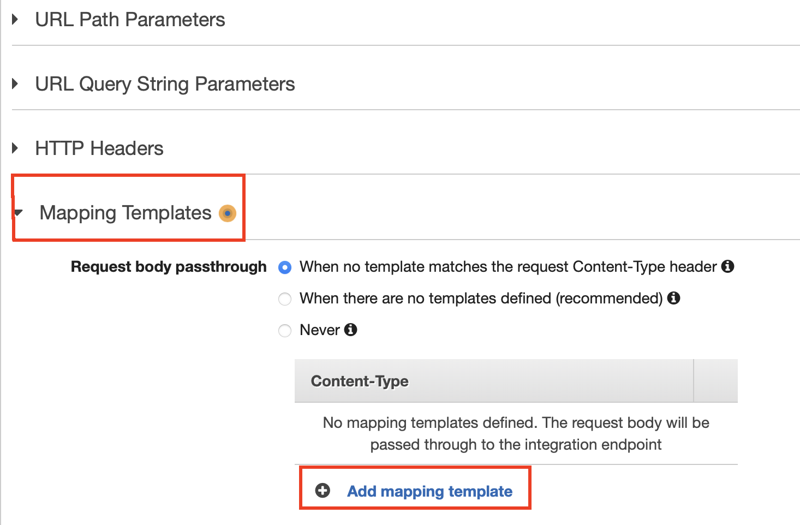

# Auto-MultiLan-Caption-deploy-Guide

## 资源总体说明

本方案圆形共需部署以下资源：

序号 | 资源类型 | 资源名称 
----|------|------
1 | SNS Topic | NotifyMe
2 | S3 Bucket | \<YOUR\_BUCKET\_NAME>
3 | DynamoDB Table | auto-multilan-cap-table
4 | IAM Role | TranslateS3
5 | IAM Role | APIGatewayToStepFunctions
6 | IAM Role | amlc-Lambda-Role 
7 | IAM Role | amlc-SF-Role
8 | Lambda Function | amlc-01-StartTranscribe
9 | Lambda Function | amlc-02-StatusTranscribe
10 | Lambda Function | amlc-03-CopySrt2TXT
11 | Lambda Function | amlc-04-StartTranslate
12 | Lambda Function | amlc-05-StatusTranslate
13 | Lambda Function | amlc-06-CopyTXT2Srt
14 | Step Functions | Auto-MultiLan-Cap
15 | API Gateway |


## 环境准备
部署说明中的命令参考 [AWS CLI Version 2 命令规范](https://awscli.amazonaws.com/v2/documentation/api/latest/reference/index.html#cli-aws)，需要根据 [官方文档](https://docs.aws.amazon.com/zh_cn/cli/latest/userguide/install-cliv2.html) 提前安装好 AWS CLI version 2 工具，并配置好拥有 Admin Account 中 **管理员权限** 的 AKSK。如您已经安装 AWS CLI Version 1，可对应本方案原型参考 [AWS CLI Version 1 命令规范](https://docs.aws.amazon.com/cli/latest/reference/)，本方案原型对可能存在的命令差异不再做进一步说明。

将本方案原型代码克隆到本地：

```
git clone  https://github.com/weiping-bj/AWS-AI-Services-in-Media-Industry.git
```

进入方案原型目录：

```
cd AWS-AI-Services-in-Media-Industry/Auto-Multi-Language-Caption
```

设置部署时需要用到的常量，```ACCOUNT_ID``` 和 ```BUCKET_NAME```：

```
ACCOUNT_ID=`aws sts get-caller-identity |jq -r ".Account"`

BUCKET_NAME=amlc-poc-$ACCOUNT_ID
```

>如未安装 [jq](https://stedolan.github.io/jq/download/) 工具，也可以手工设置 ACCOUNT_ID

## 资源部署
### SNS Topic

需要创建 1 个 SNS Topic：

- NotifyMe：用户订阅这个主题，以便获得自动生成的多语言字幕所在位置。

创建 SNS 主题：

```
NOTIFY_TOPIC_ARN=`aws sns create-topic --name NotifyMe --region us-east-1 | jq -r ".TopicArn"`
```

通过 AWS 控制台选择 ```Amazon SNS > 订阅 > 创建订阅```，输入网络管理员邮件地址，如下图：  


需要通过用户的邮箱确认上述订阅。

### S3 存储桶

本资源为选择性创建，可以利用现有存储桶，也可以创建独立的存储桶。无论何种方式，保证存储桶中有以下 3 个目录即可：

- /video：存放待处理的视频文件；
- /transcribe-srt：用于保存 transcribe 的处理结果；
- /translate-srt：用于保存 translate 的处理结果。

[创建存储桶](https://docs.aws.amazon.com/zh_cn/AmazonS3/latest/userguide/create-bucket-overview.html) 和 [创建目录](https://docs.aws.amazon.com/zh_cn/AmazonS3/latest/userguide/using-folders.html) 的方式可参考官方手册。存储桶可根据管理需要自定义命名。

### DynamoDB 表

通过控制台，```DynamoDB > 表 > 创建表```，表的名称为 ```auto-multilan-cap-table```，Partition Key 设置为 ```TranscribeJobName```：  


将 Table 名称设置为系统的环境变量：

```
DDB_TABLE=auto-multilan-cap-table
```

### IAM Role

**1. APIGatewayToStepFunctions**

API Gateway 在调用 Step Functions 状态机时使用的角色。可通过控制台创建并自动关联需要的 IAM 策略，遵循 [官方指导](https://docs.aws.amazon.com/zh_cn/step-functions/latest/dg/tutorial-api-gateway.html#api-gateway-step-1) 即可。

**2. TranslateS3**

通过控制台或命令行创建一个角色，信任实体为 Translate 服务，关联以下托管策略：

- AmazonS3FullAccess

将该角色的 ARN 设定为环境变量：

```
TRANSLATE_ROLE=<Role Arn>
```

**3. amlc-Lambda-Role**

通过控制台或命令行创建一个角色，信任实体为 Lambda 服务，关联以下托管策略：

- AmazonS3FullAccess
- AmazonTranscribeFullAccess
- AmazonTranslateFullAccess
- CloudWatchLogsFullAccess
- AmazonSNSFullAccess
- AmazonDynamoDBFullAccess

将该角色的 ARN 设定为环境变量：

```
AMLC_ROLE=<Role Arn>
```

### Lambda 函数

共需要创建 6 个 Lambda 函数，依次创建如下。

**1. amlc-01-StartTranscribe**

通过控制台查看 S3 存储桶中 /transcribe-srt 目录的 S3 URI，并保存为环境变量：

```
INTER_FOLDER=</transcribe-srt 目录的 S3 URI>
```

创建函数：

```
aws lambda create-function --function-name amlc-01-StartTranscribe \
--role $AMLC_ROLE \
--runtime python3.7 \
--handler lambda_function.lambda_handler \
--timeout 5 \
--zip-file fileb://resources/amlc-01-StartTranscribe.zip \
--environment "Variables={ \
INTER_BUCKET="$INTER_FOLDER", \
TABLE_NAME="$DDB_TABLE"}"
```

该函数将启动 Transcribe 作业，并将 Transcribe 作业的语音转录结果保存在 <code>$INTER_FOLDER</code> 中。

可从 [这里](code/amlc-01-StartTranscribe.py) 查看该函数代码。

**2. amlc-02-StatusTranscribe**

创建函数：

```
aws lambda create-function --function-name amlc-02-StatusTranscribe \
--role $AMLC_ROLE \
--runtime python3.7 \
--handler lambda_function.lambda_handler \
--timeout 5 \
--zip-file fileb://resources/amlc-02-StatusTranscribe.zip
```

该函数将检查 Transcribe 作业的执行结果，并将任务的状态作为输出传递给状态机中的下一个环节。

可从 [这里](code/amlc-02-StatusTranscribe.py) 查看该函数代码。

**3. amlc-03-CopySrt2TXT**

通过控制台查看 S3 存储桶中 /translate-srt 目录的 S3 URI，并保存为环境变量：

```
 TXT_FOLDER=</translate-srt 目录的 S3 URI>/temp-txt/
```

>【注意】这里要设置的是在 /translate-srt 目录下的一个子目录，用来保存临时生成的 txt 文件，所以在 /translate-srt 的路径后还要加上 /temp-txt/。

创建函数：

```
aws lambda create-function --function-name amlc-03-CopySrt2TXT \
--role $AMLC_ROLE \
--runtime python3.7 \
--handler lambda_function.lambda_handler \
--timeout 5 \
--zip-file fileb://resources/amlc-03-CopySrt2TXT.zip \
--environment "Variables={ \
INTER_BUCKET="$TXT_FOLDER", \
TABLE_NAME="$DDB_TABLE"}"
```

由于 Translate 不能直接打开 srt 文件，需要将 Transcribe 生成的 srt 文件先转换成 txt 文件保存在 <code>$TXT_FOLDER</code> 中，然后再执行 Translate 作业。

可从 [这里](code/amlc-03-CopySrt2TXT.py) 查看该函数代码。

**4. amlc-04-StartTranslate**

通过控制台查看 S3 存储桶中 /translate-srt 目录的 S3 URI，并保存为环境变量：

```
 TRANSLATE_FOLDER=</translate-srt 目录的 S3 URI>
```

创建函数：

```
aws lambda create-function --function-name amlc-04-StartTranslate \
--role $AMLC_ROLE \
--runtime python3.7 \
--handler lambda_function.lambda_handler \
--timeout 5 \
--zip-file fileb://resources/amlc-04-StartTranslate.zip \
--environment "Variables={ \
INTER_BUCKET="$TRANSLATE_FOLDER", \
TABLE_NAME="$DDB_TABLE", \
ROLE_ARN="$TRANSLATE_ROLE"}"
```

该函数将启动 Translate 作业，并将结果保存在 <code>$TRANSLATE_FOLDER</code> 中。

可从 [这里](code/amlc-04-StartTranslate.py) 查看该函数代码。

**5. amlc-05-StatusTranslate**

创建函数：

```
aws lambda create-function --function-name amlc-05-StatusTranslate \
--role $AMLC_ROLE \
--runtime python3.7 \
--handler lambda_function.lambda_handler \
--timeout 5 \
--zip-file fileb://resources/amlc-05-StatusTranslate.zip
```

该函数将检查 Transcribe 作业的执行结果，并将任务的状态作为输出传递给状态机中的下一个环节。

可从 [这里](code/amlc-05-StatusTranslate.py) 查看该函数代码。

**6. amlc-03-CopySrt2TXT**

创建函数：

```
aws lambda create-function --function-name amlc-06-CopyTXT2Srt \
--role $AMLC_ROLE \
--runtime python3.7 \
--handler lambda_function.lambda_handler \
--timeout 5 \
--zip-file fileb://resources/amlc-06-CopyTXT2Srt.zip \
--environment "Variables={ \
INTER_BUCKET="$TRANSLATE_FOLDER", \
TABLE_NAME="$DDB_TABLE", \
TOPIC_ARN="$NOTIFY_TOPIC_ARN"}"
```

由于 Translate 不能直接打开 srt 文件，需要将 Transcribe 生成的 srt 文件先转换成 txt 文件保存在 <code>$TXT_FOLDER</code> 中，然后再执行 Translate 作业。

可从 [这里](code/amlc-06-CopyTXT2Srt.py) 查看该函数代码。

### Step Functions

**1. amlc-SF-Role**

首先需要为 Step Funcitons 状态机创建一个 IAM 角色，授权状态机可以调用对应的 Lambda 函数。

```
ACCOUNT_ID=`aws sts get-caller-identity | jq -r ".Account"`

REGION_NAME=`aws configure get region`

ROLE_NAME=amlc-SF-Role

aws iam create-role --role-name $ROLE_NAME --assume-role-policy-document file://resources/sf-iam-trusted.json 

sed -i "" 's/<ACCOUNT_ID>/'$ACCOUNT_ID'/g' resources/sf-iam-policy.json

sed -i "" 's/<REGION_NAME>/'$REGION_NAME'/g' resources/sf-iam-policy.json

aws iam create-policy --policy-name $ROLE_NAME-policy --policy-document file://resources/sf-iam-policy.json

aws iam attach-role-policy --role-name $ROLE_NAME --policy-arn arn:aws:iam::$ACCOUNT_ID\:policy/$ROLE_NAME-policy

aws iam attach-role-policy --role-name $ROLE_NAME --policy-arn arn:aws:iam::aws:policy/CloudWatchLogsFullAccess
```

>【注意】本手册中以资源部署在 **us-east-1** 为例进行步骤描述，如希望部署在其它区域，还需要上述 json 文件中，

**2. 创建状态机**

```
SF_NAME=Auto-MultiLan-Cap

sed -i "" 's/<ACCOUNT_ID>/'$ACCOUNT_ID'/g' resources/stepFunctions.json

sed -i "" 's/<REGION_NAME>/'$REGION_NAME'/g' resources/stepFunctions.json

aws stepfunctions create-state-machine --name $SF_NAME --definition file://resources/stepFunctions.json --role-arn arn:aws:iam::$ACCOUNT_ID\:role/$ROLE_NAME
```

### API Gateway

可参考 [AWS 官方手册](https://docs.aws.amazon.com/zh_cn/step-functions/latest/dg/tutorial-api-gateway.html) 创建 API Gateway 并与刚刚创建好的 Step Functions 状态机进行集成。

在创建过程中，注意以下几点个性化设置：
1. 根据管理需要为 IAM Role，API Gateway 及 resource、stage 命名；
2. 创建的 API Gateway 类型为 REST API；
3. 为 resource 创建的 Method 为 POST；
4. 区域选择 us-east-1（也可以根据需要自行选定区域，选择不同区域）。

创建完成后，还需要进行如下操作：

- 创建完 Method 后，点击刚刚创建好的 POST，在主窗口中点击 “Integration Request”，如下图：
 

 - 进入后，点击 Mapping Templates 展开，点击 Add mapping template，如下图：
 

- Content-Type 文本框中输入 application/json，点击对勾，在随后弹出的提示窗口中选择 “No, use current settings”。（本原型方案中采用 Passthrough 方式即可）

- 在最下方文本框中输入如下内容：

```
{
    "input": "$util.escapeJavaScript($input.json('$'))",
    "stateMachineArn": "<STATE_MACHINE_ARN>"
}
```

如下图示例：
 


至此，方案部署完毕。

[返回 README](README.md)