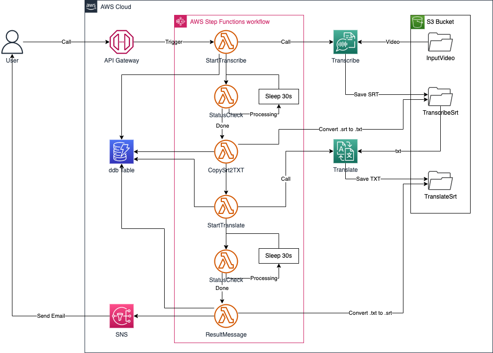
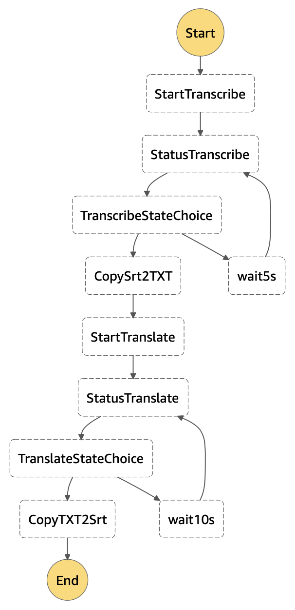
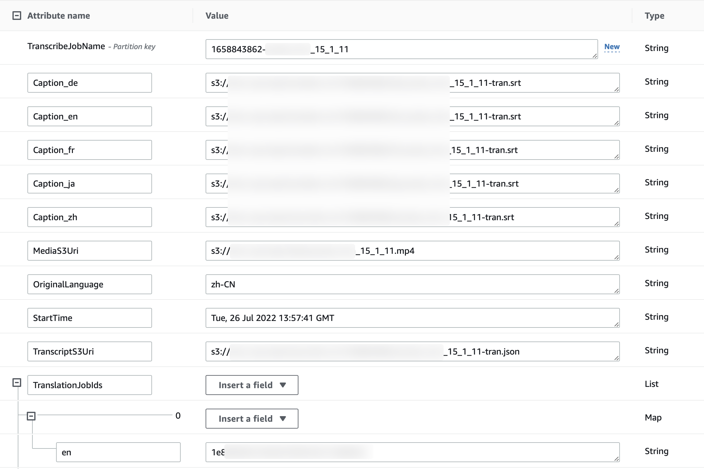

# Auto-Multi-Language-Caption

## 方案概述

- 适用场景：有大量存量视频，需要为视频生成字幕文件，并需要针对不同目标语言生成翻译好的多语种。

- 方案概述：本方案原型将姐好啊一种基于 AI 技术生成多语种字幕的方法。这一方法包含两个主要步骤。一， 利用 ASR 技术，将视频中的语音转换成文本；二，利用自动翻译技术，将生成的源语言文本翻译成需要的目标语言。

- 方案特点：
  - 整个方案使用 AWS 托管服务，无需部署服务器资源；
  - 借助 AI 技术，自动完成语音转文本、多语言翻译工作；
  - 无需准备海量训练样本，无需掌握复杂的机器学习技能。

## 架构概述

### 系统架构

本方案原型将采用如下架构：


使用到了如下服务：
1. [Amazon Translate](https://aws.amazon.com/cn/translate/)：神经网络机器翻译服务；
2. [AWS Transcribe](https://aws.amazon.com/cn/transcribe/)：使用一种称为自动语音识别 (ASR) 的深度学习过程，快速准确地将语音转换为文本；
3. [Amazon API Gateway](https://aws.amazon.com/cn/api-gateway/)：一种完全托管的服务，可以帮助开发人员轻松创建、发布、维护、监控和保护任意规模的 API；
4. [AWS Lambda](https://aws.amazon.com/cn/lambda/)：一种无服务器的计算服务，让您无需预置或管理服务器、创建可感知工作负载的集群扩展逻辑、维护事件集成或管理运行时，即可运行代码；
5. [AWS Step Functions](https://aws.amazon.com/cn/step-functions/)：一个无服务器函数编排工具，可轻松将 AWS Lambda 函数和多个 AWS 服务按顺序安排到业务关键型应用程序中；
6. [Amazon DynamoDB](https://aws.amazon.com/cn/dynamodb/)：一种完全托管式、无服务器的 NoSQL 键值数据库；
7. [Amazon S3](https://aws.amazon.com/cn/s3/)：对象存储服务，提供行业领先的可扩展性、数据可用性、安全性和性能；
8. [Amazon SNS](https://aws.amazon.com/cn/sns/)：一项用于应用与应用之间 (A2A) 以及应用与人之间 (A2P) 通信的完全托管型消息收发服务。

该方案执行过程中将遵循如下步骤：
1. 用户调用 API Gateway，通过参数告知源视频所在位置（S3 path）、所需目标语言；
2. API Gateway 调用 Step Functions 中的状态机，激活多个 Lambda 函数实现相关功能；
3. Lambda 函数调用 Transcribe 实现语音转文本功能，调用 Translate 实现自动翻译功能，并将相关的过程状态存储在 DynamoDB 表中；
4. 多语言字幕生成完毕后，通过 SNS 向用户发送邮件，邮件以 JSON 格式告知多语言字幕所在位置（S3 path）。

### Step Functions 状态机设计

 API-Gateway 的调用和 Lambda 函数都有超时限制，Transcribe 和 Translate 任务并不一定能在限制时间内完成。此外，长时间运行 lambda 以等待任务结束也会增加不必要的运行成本。因此本方案采用 Step Functions 创建状态机，用以编排各个 Lambda 函数。

 状态机创建完毕后，流程框架如下：
 

 各个 Lambda 函数的功能说明如下：

 - StartTranscribe：启动 Transcribe 任务，将任务创建时间、任务名称、视频存放位置写入到 DynamoDB 表中；
 - StatusTranscribe：查看 Transcribe 任务状态
 - TranscribeStateChoice：状态机自有模块，对 StatusTranscribe 的输出进行判断，若任务未完成则等待 5 秒后重新执行 StatusTranscribe，若任务状态已经是 COMPLETED，则进入到下一环节；
 - CopySrt2TXT：因 Translate 无法直接读取 srt 文件，需要将 srt 文件转存为 txt 文件，同时向 DynamoDB 表中写入源语言代码、源语言 srt 保存位置、Transcribe 原始输出文件位置信息；
 - StartTranslate：启动 Translate 任务，如需翻译成多种目标语言，代码会自动启动多个 Translate 任务，并将 translate job id 计入 DynamoDB 表（此处调用 Translate 的批处理 API，实时翻译的 API 单词输入文本不能超过 5000 字节，难以满足长视频的要求）；
 - StatusTranslate：查看 Translate 任务状态
 - TranslateStateChoice：状态机自有模块，对 StatusTranslate 的输出进行判断，若任务未完成则等待 10 秒后重新执行 StatusTranslate，若任务状态已经是 COMPLETED，则进入到下一环节；
 - CopyTXTSrt：将 Translate 输出的 txt 文件转存为 srt 文件，并以邮件方式通知用户，同时向 DynamoDB 表中写入各语言 srt 文件的位置信息。

状态机中，各环节的输入、输出参数示例如下图显示：


### DynamoDB 说明
DynamoDB 表的示例如下：


其中各字段说明如下：
- TranscribeJobName: Transcribe 任务名称，也作为 DynamoDB 表的 partition key；
- Caption_xx：记录不同语言的 srt 文件保存位置（S3 path）；
- MediaS3Uri：本次任务所使用的源视频的保存位置（S3 path）；
- OriginalLanguage：源视频中的语言语种；
- StartTime：任务发起的时间，这里以 Transcribe 任务的发起时间作为整个功能调用的初始时间；
- TranscriptS3Uri：Transcribe 任务所生成的原始结果，以词为单位记录所有元素在视频中的时间点（S3 path）；
- TranslationJobIds：以 key:value 的形式记录所有的 translation 任务 ID，key 为目标语言的代码，value 是 job id。

## 方案部署说明

参见 [部署说明](Auto-MultiLan-Caption-deployment-CHN.md)。

## 方案使用说明

在 API Gateway 页面中查询到 invoke url，以如下格式调用 API：

```json
{
	"videoPath": "s3://<BUCKET_NAME>/<FOLDER_NAME>/<VIDEO_NAME>.mp4",
	"targetLanguageCodes": ["xx", "xx", "xx", "xx"]
}
```

Amazon 支持的语言及对应的 Language Code 可以在 [Supported languages and language codes](https://docs.aws.amazon.com/translate/latest/dg/what-is-languages.html) 的表格中查到。

## 反馈邮件示例

任务执行完毕后，用户将收到如下格式的 JSON 文件。用户可根据需要自行作进一步的处理。

>以下示例使用的视频文件中，源语言为中文，希望翻译的目标语言为英语、德语、日语、法语。

```json
{
    "TranslatedCaptionInformation": {
        "InputVideoS3Path": "s3://xxxxx.mp4",
        "SourceLanguageCode": "zh",
        "TranslatedCaptionCount": 4,
        "TranslatedOutput": [
        {
            "TargetLanguageCode": "en",
            "CapSrtS3Path": "s3://en.xxxxx.srt"
        },
        {
            "TargetLanguageCode": "de",
            "CapSrtS3Path": "s3://de.xxxxx.srt"
        },
        {
            "TargetLanguageCode": "ja",
            "CapSrtS3Path": "s3:ja.xxxxx.srt"
        },
        {
            "TargetLanguageCode": "fr",
            "CapSrtS3Path": "s3://fr.xxxxx.srt"
        }
        ]
    }
}
```

[返回 README](../README.md)