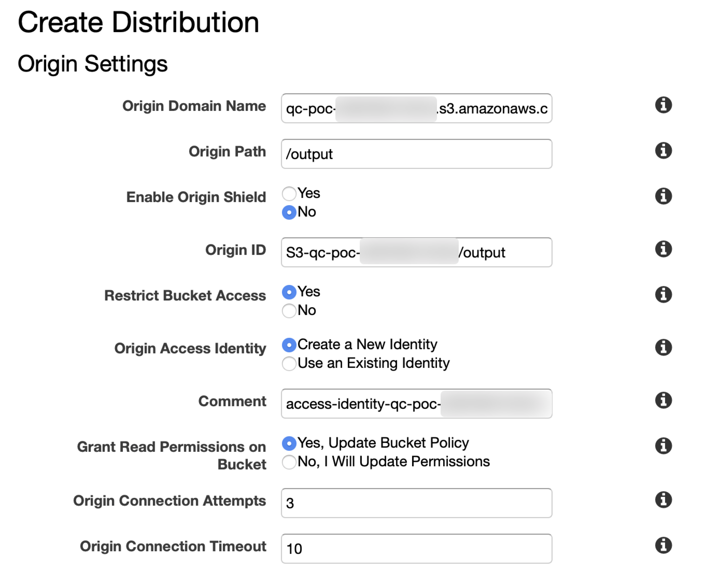
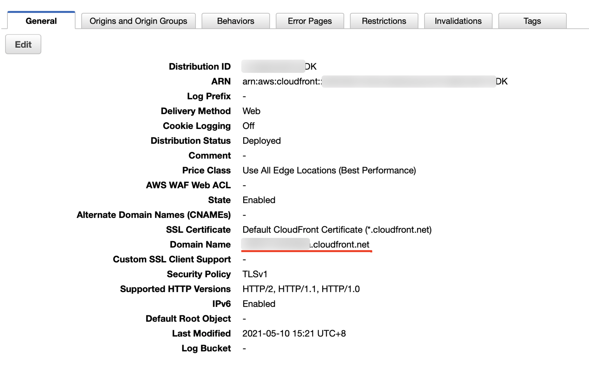
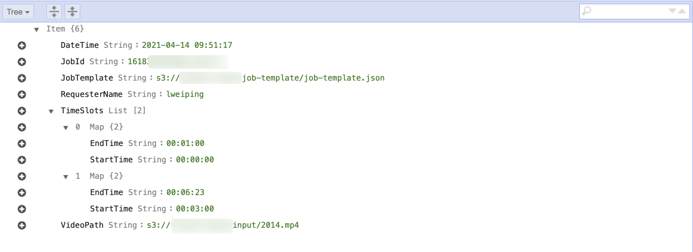
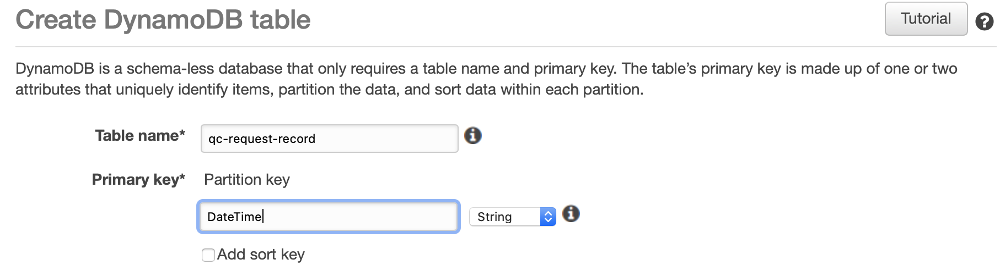
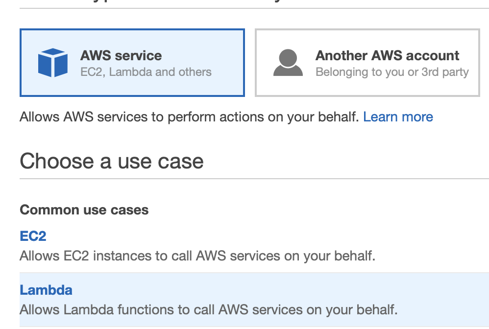
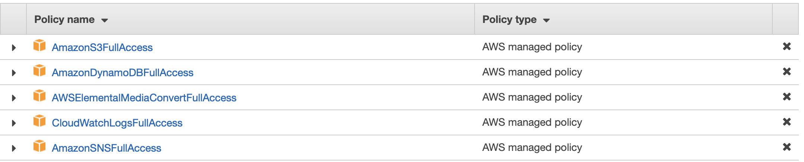
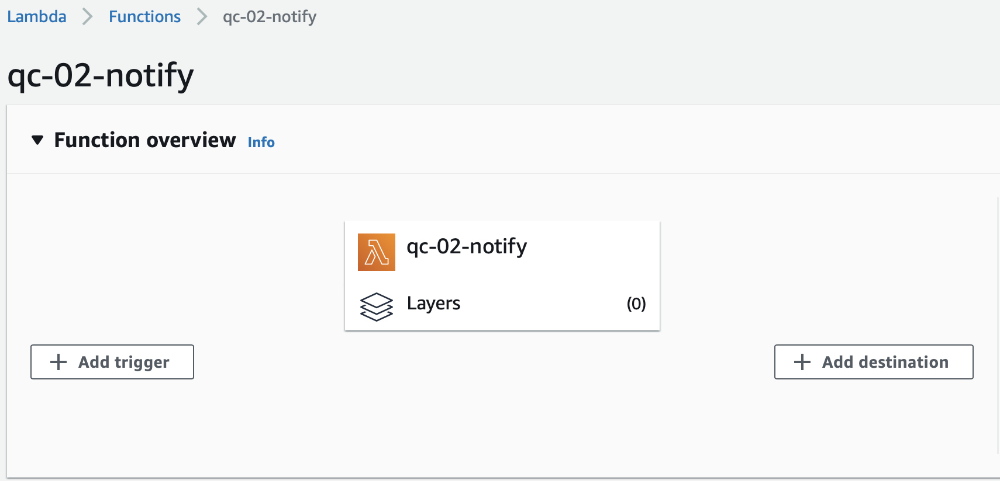
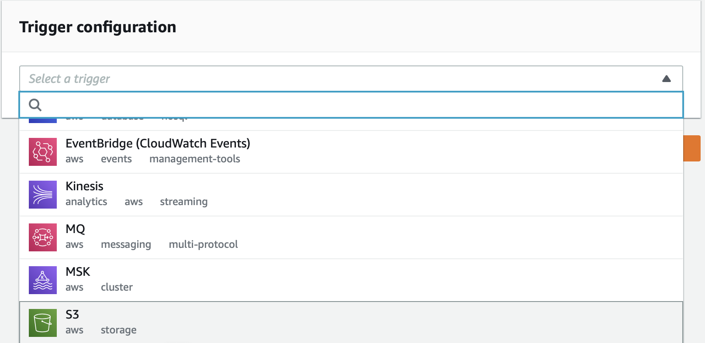
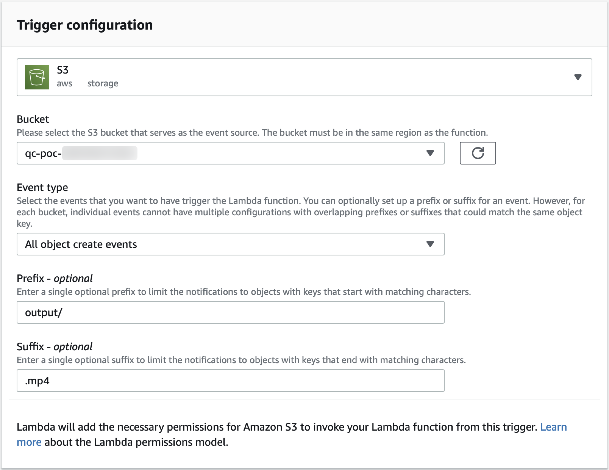

# Quick-Clips-Deploy-Guide

## 环境准备

1. 安装好 [AWS CLI 工具]((https://docs.aws.amazon.com/zh_cn/cli/latest/userguide/install-cliv2.html))，并配置好管理员权限的 [AKSK](https://docs.aws.amazon.com/zh_cn/general/latest/gr/aws-sec-cred-types.html#access-keys-and-secret-access-keys)，Region 处填写 ```us-east-1```（也可以是海外任何一个发布了 MediaConvert 服务的区域）；
2. （推荐）安装好 [jq](https://stedolan.github.io/jq/download/)
3. AWS 账号内已经创建了 [CloudTrail Trail](https://docs.aws.amazon.com/zh_cn/awscloudtrail/latest/userguide/cloudtrail-create-a-trail-using-the-console-first-time.html)。
4. 将本方案代码克隆到本地：

```
git clone  https://github.com/weiping-bj/Quick-Clips-with-AWS-MediaConvert.git
```

进入方案目录：

```
cd Quick-Clips-with-AWS-MediaConvert
```

设置部署时需要用到的常量，```ACCOUNT_ID``` 和 ```BUCKET_NAME```：

```
ACCOUNT_ID=`aws sts get-caller-identity |jq -r ".Account"`

BUCKET_NAME=qc-poc-$ACCOUNT_ID
```

>如未安装 [jq](https://stedolan.github.io/jq/download/) 工具，也可以手工设置 ACCOUNT_ID

本说明使用弗吉尼亚区域（us-east-1）进行演示，如果部署在 AWS 在中国大陆地区的两个区域（BJS、ZHY），还需要具备一个已经完成备案的域名。

需要部署以下资源：

序号 | 资源类型 | 资源名称 
----|------|------
1 | SNS Topic | NotifyMe
2 | S3 Bucket | \<YOUR\_BUCKET\_NAME>
3 | IAM Role | qcRole 
4 | DynamoDB Table | poc-quick-clips 
5 | Lambda Function | qc-01-clipping
6 | Lambda Function | qc-02-notify
7 | CloudFront Distribution | 
8 | API Gateway | qc

## 部署资源
### SNS Topic
创建 SNS 主题：

```
TOPIC_ARN=`aws sns create-topic --name NotifyMe --region us-east-1 | jq -r ".TopicArn"`
```
创建成功后，返回 SNS Topic 的 ARN。

通过 AWS 控制台选择 ```Amazon SNS > 订阅 > 创建订阅```，输入网络管理员邮件地址，如下图：  


需要通过管理员的邮箱确认上述订阅。

### S3 Bucket

创建 S3 Bucket：

```
aws s3api create-bucket --bucket $BUCKET_NAME \
--region us-east-1
```

创建成功后，返回 S3 Bucket 的 ARN。在 S3 Bucket  中创建 3 个目录。目录名称及作用说明如下：

- **input/**：用于保存需要处理的视频文件。

```
aws s3api put-object --bucket $BUCKET_NAME \
--key input/
```

- **job-template/**：用于保存创建 MediaConvert 作业时需要用到的作业模板。

```
aws s3api put-object --bucket $BUCKET_NAME \
--key job-template/
```

将本方案中提供的作业模板上传到新创建的目录下：

```
aws s3 cp resources/job-template.json s3://$BUCKET_NAME/job-template/
```

- **output/**：用于保存截取后的视频文件。

```
aws s3api put-object --bucket $BUCKET_NAME \
--key output/
```

### CloudFront Distribution

登录 AWS 控制台进入 CloudFront 界面，进入```CloudFront > 分配 > 创建分配```，在 ```源域名``` 处输入之前创建的 S3 存储桶名称（可以从下拉菜单中获取），```源路径``` 处输入 ```output/```。

为提升数据安全性，设置 S3 中内容仅可以通过 CloudFront 访问，参考如下设置：

- 限制存储桶访问：是
- 源访问身份：创建新身份
- 注视：保持默认值即可
- 授予对存储桶的读取权限：是，更新存储桶策略

其它参数保持默认，如下图：  


从 AWS 控制台中进入到刚刚创建的分配，在 ```常规``` 标签下查看该分配的域名：  


将分配的域名设置为系统变量：

```
DIS_DOMAIN=xxxxxxx.cloudfront.net
```

### DynamoDB Table
DynamoDB Table 将记录不同使用者请求视频片段的信息：  


通过控制台，```DynamoDB > 表 > 创建表```，表的名称为 ```qc-request-record```：  


### IAM Role
为本方案中的 2 个 Lambda 函数创建一个统一的 IAM Role。
>您还可以根据需要进一步缩小权限，为每个 Lambda 函数创建独立的 IAM Role。

通过控制台，```IAM > 角色 > 创建角色```，选择为 Lambda 创建角色：  


在 ```Attach 权限策略``` 步骤中，选择以下 5 个托管策略：  


为角色命名为 ```qcRole```。

### Lambda Function
本方案中需要创建 2 个 Lambda 函数：

1. **qc-01-clipping**：根据请求中的参数截取视频
2. **qc-02-notify**：将截取后的结果返回给管理员。

#### qc-01-clipping

```
aws lambda create-function --function-name qc-01-clipping \
--role "arn:aws:iam::"$ACCOUNT_ID":role/qcRole" \
--runtime python3.6 \
--handler lambda_function.lambda_handler \
--timeout 60 \
--zip-file fileb://resources/qc-01-clipping.zip \
--environment "Variables={ \
BUCKET_PATH=s3://$BUCKET_NAME/output/, \
TEMPLATE_PATH=s3://$BUCKET_NAME/job-template/job-template.json,\
DDB_TABLE=qc-request-record}" \
--region us-east-1
```

可以从 [这里](code/qc-01-clippinl.py) 查看函数源代码。

函数创建同时，添加了如下环境变量：

Key | Value | 
----|-----
BUCKET\_PATH | s3://`<YOUR_BUCKET_NAME>`/output/ 
TEMPLATE\_PATH | s3://`<YOUR_BUCKET_NAME>`/job-template.json 
DDB\_TABLE | qc-request-record

#### qc-02-notify

```
aws lambda create-function --function-name qc-02-notify \
--role "arn:aws:iam::"$ACCOUNT_ID":role/qcRole" \
--runtime python3.6 \
--handler lambda_function.lambda_handler \
--zip-file fileb://resources/qc-02-notify.zip \
--environment "Variables={ \
CF_URL=$DIS_DOMAIN, \
TOPIC_ARN=$TOPIC_ARN}" \
--region us-east-1
```

可以从 [这里](code/qc-02-notify.py) 查看函数源代码。

函数创建同时，添加了如下环境变量：

Key | Value | 
----|-----
CF\_URL | xxxxx.cloudfront.net 
TOPIC\_ARN | arn:aws:sns:us-east-1:```<YOUR_ACCOUNT_ID>```:NotifyMe 

通过 AWS 控制台进入 ```Lambda``` 页面，进入刚创建的 ```qc-02-notify``` 函数，点击 ```添加触发器```：  
 

从下拉菜单中选择 S3：  
 

参考下图输入相关参数，并勾选 `递归调用` 的确认声明：

参数 | 值 | 
----|-----
存储桶 | qc-poc-```<ACCOUNT_ID>``` 
事件类型 | 所有对象创建事件 
前缀 | output/ 
后缀 | .mp4  

 

### API Gateway
创建 APIs：

```
REST_API_ID=`aws apigateway create-rest-api --name quick-clips \
--endpoint-configuration types=REGIONAL \
--region us-east-1 | jq -r ".id"`
```

如未安装 [jq](https://stedolan.github.io/jq/download/) 工具，也可以手工设置 ```REST_API_ID```。执行 ```create-rest-api``` 后，得到如下返回：

```
{
    "id": "xxxxxxx",
    "name": "quick-clips",
    "createdDate": "2021-04-19T22:42:39+08:00",
    "apiKeySource": "HEADER",
    "endpointConfiguration": {
        "types": [
            "REGIONAL"
        ]
    },
    "tags": {},
    "disableExecuteApiEndpoint": false
}
```
设置返回的 id 为 ```REST_API_ID```。  

查看刚创建的 api-gateway 的资源，并设置 parent-id：

```
PARENT_ID=`aws apigateway get-resources --rest-api-id $REST_API_ID --region us-east-1 | jq -r ".items" | jq -r ".[0].id"`
```

如仅执行 ```get-resources```，得到如下返回：

```
{
    "items": [
        {
            "id": "yyyyyyyyyy",
            "path": "/"
        }
    ]
}
```

可手工记录下返回的 id 并设置为 ```PARENT_ID```。

创建资源 ```clips```：

```
RESOURCE_ID_CLIPS=`aws apigateway create-resource --rest-api-id $REST_API_ID \
--parent-id $PARENT_ID \
--path-part clips \
--region us-east-1 |jq -r ".id"`
```

如仅执行 ```create-resource```，记录下返回的资源 id，并手工设置 ```RESOURCE_ID_CLIPS```：

```
{
    "id": "zzzzzz",
    "parentId": "yyyyyyyyyy",
    "pathPart": "clips",
    "path": "/clips"
}
```

为资源创建方法：

```
aws apigateway put-method --rest-api-id $REST_API_ID \
--resource-id $RESOURCE_ID_CLIPS \
--http-method POST \
--authorization-type NONE \
--region us-east-1
```

为创建的方法设定集成：

```
aws apigateway put-integration --rest-api-id $REST_API_ID \
--resource-id $RESOURCE_ID_CLIPS \
--http-method POST \
--type AWS --integration-http-method POST \
--uri 'arn:aws:apigateway:us-east-1:lambda:path/2015-03-31/functions/arn:aws:lambda:us-east-1:'$ACCOUNT_ID':function:qc-01-clipping/invocations' \
--region us-east-1
```

为方法设定响应：

```
aws apigateway put-method-response --rest-api-id $REST_API_ID \
--resource-id $RESOURCE_ID_CLIPS \
--http-method POST \
--status-code 200 \
--response-models '{"application/json": "Empty"}' \
--region us-east-1
```

为集成设定响应：

```
aws apigateway put-integration-response --rest-api-id $REST_API_ID \
--resource-id $RESOURCE_ID_CLIPS \
--http-method POST \
--status-code 200 \
--selection-pattern "" \
--response-templates '{"application/json": "{\"json\": null}"}' \
--region us-east-1
```

为 Lambda 函数 ```qc-01-clipping``` 添加允许 API Gateway 调用的权限：

```
aws lambda add-permission --function-name qc-01-clipping \
--statement-id AllowInvokeFromQC_clips \
--action lambda:InvokeFunction \
--principal apigateway.amazonaws.com \
--source-arn "arn:aws:execute-api:us-east-1:"$ACCOUNT_ID":"$REST_API_ID"/*/POST/clips" \
--region us-east-1
```

部署 API：  

```
aws apigateway create-deployment --rest-api-id $REST_API_ID \
--stage-name poc \
--region us-east-1
```

至此，方案部署完毕。使用说明请参考 [使用指导](QuickClips-usage-CHN.md)。

[返回 README](README.md)

