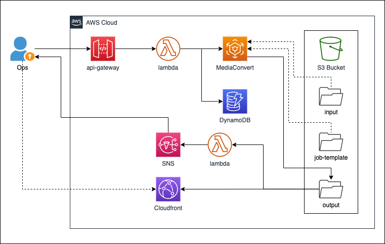

# Quick-Clips-with-MediaConvert

## 方案介绍
本方案架构框架如下：  


管理员调用 API，提供如下信息：

```
{
	"videoPath": "s3://<BUCKET_NAME>/<FOLDER>/<VIDEO>.mp4",
	"requesterName": "<REQUESTER NAME>",
	"timeSlot": [
		{
			"StartTime": "HH:MM:SS",
			"EndTime": "HH:MM:SS"
		}
	]
}
```

如果需要截取多个片段，可以在 timeSlot 中提供多个起止时间。本方案会将多个时间片段剪切出来，并合并成一个视频文件以供下载。

API Gateway 调用后端 lambda 函数。lambda 函数启动一个 MediaConvert 任务，根据传入的参数进行视频截取。lambda 函数还将在 DynamoDB 中记录此次请求的相关信息，以备以后查看。

截取后的视频保存在 S3 Bucket 中，这会生成一个 S3 Event。利用这个 Event 触发另一个 lambda 函数。该函数会将处理结果、视频下载的地址链接以邮件形式通知给管理员。

管理员通过 CloudFront 下载截取后的视频文件。

关于方案的部署过程，请参考 [部署指导](QuickClips-deploy-CHN.md)。  
方案中各参数的说明，请参考 [使用指导](QuickClips-usage-CHN.md)。

