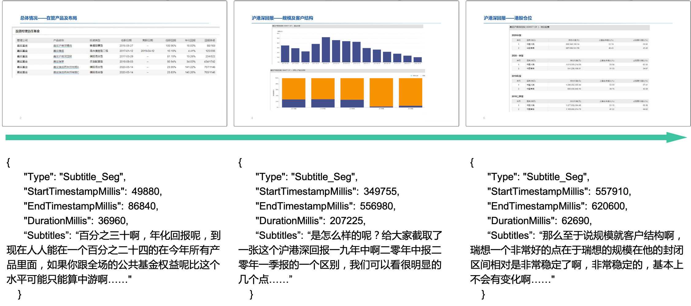
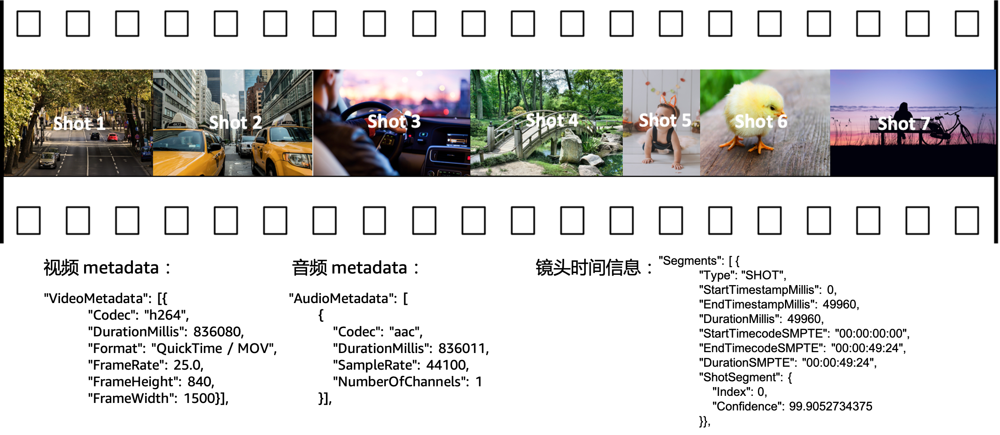
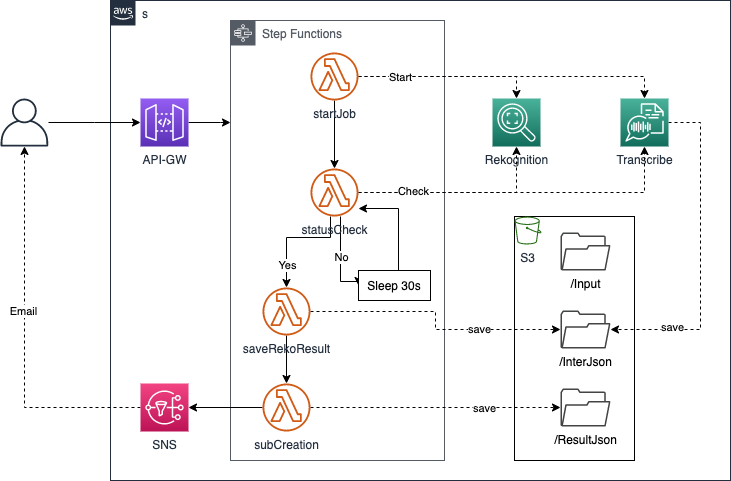
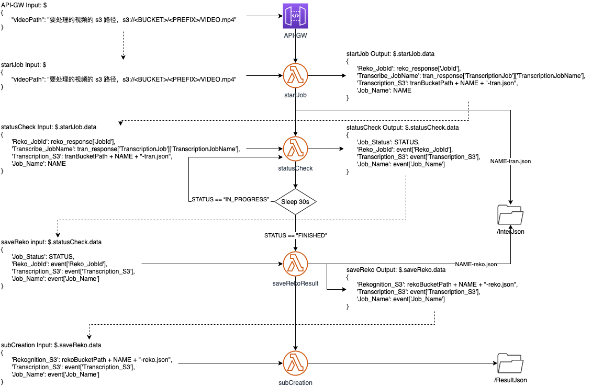
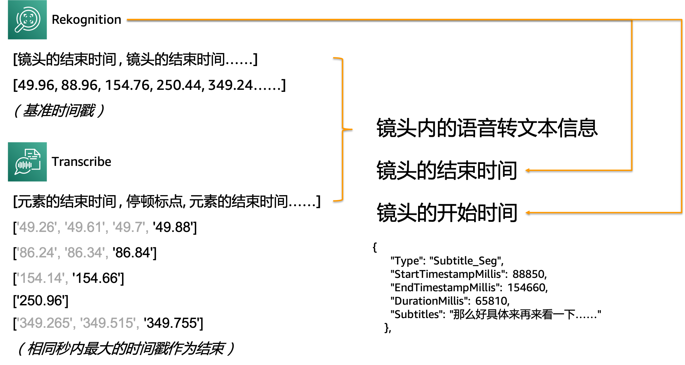

# Smart-Sub-on-PPT-Pages
 
自新冠疫情爆发以来，越来越多的企业开始选择通过线上的方式进行内部培训、外部宣讲、市场宣传等活动。绝大多数活动中，演讲者向所有听众共享自己的屏幕，伴随 PPT 的翻页进行内容的讲解。

这里将介绍一种方案，基于 PPT 的翻页提取演讲者的语音内容，以便帮助回看的观众快速定位到自己感兴趣的内容。

提取字幕的效果如下图示意：


由于识别结果保留了时间戳信息，在此基础上最终用户还可以通过检索关键字快速定位到 PPT 所在位置。该场景的实现不在本文描述范围之内，可以根据自己应用需求进行拓展。

如已了解相关服务和设计源自，可直接阅读本方案的 [部署说明](deployment-cn.md)

## 关键服务介绍
基于 PPT 换页进行字幕提取主要依赖于两项技术：

- 视频内容识别：用于对视频进行检索，以识别出每一页 PPT 的起止时间戳；
- 自动语音识别：将演讲者的语音转录成文本。

以 AWS 为例，这两项服务分别对应 [Amazon Rekognition](https://aws.amazon.com/cn/rekognition/?nc2=h_ql_prod_ml_rek&blog-cards.sort-by=item.additionalFields.createdDate&blog-cards.sort-order=desc) 和 [Amazon Transcribe](https://aws.amazon.com/cn/transcribe/?nc2=h_ql_prod_ml_ts) 服务。

**Amazon Rekognition**

Rekognition 服务可以针对视频或图像中的内容进行识别，并给出识别目标的相关信息。这里将借助 Rekognition 的 [镜头检测](https://docs.aws.amazon.com/zh_cn/rekognition/latest/dg/segments.html#segment-shot-detection) 功能。



镜头检测将识别镜头的切换，包括单个镜头的开始、截止、持续时间，提供毫秒和时间（HH:MM:SS:FF ）戳两种格式 。每一次 PPT 的换页与镜头切换的实际效果相同，因此可以使用该功能来提取 PPT 换页的时间戳信息。

**Amazon Transcribe**

Transcribe 服务可以从指定的视频、音频文件中提取语音信息并转录成文本。在 Transcribe 给出的结果中既包含对整个文件中语音信息的转录结果，也包括每一个元素（字或词）的提取结果（包含时间戳信息）。如下面 JSON 文件所展示的：

```json
{
	"jobName": "20200811",
	"accountId": "285792212242",
	"results": {
		"transcripts": [{"transcript": "大家下午好……我们下期再见，谢谢大家！"}],
		"items": [{
			"start_time": "0.54",
			"end_time": "0.84",
			"alternatives": [{
				"confidence": "0.9999",
				"content": "大家"
			}],
			"type": "pronunciation"}, {
			"start_time": "0.84",
			"end_time": "1.1",
			"alternatives": [{
				"confidence": "0.7225",
				"content": "下午"
			}],
			"type": "pronunciation"}, {
			"start_time": "1.1",
			"end_time": "1.54",
			"alternatives": [{
				"confidence": "0.7698",
				"content": "好"}],
			"type": "pronunciation"},
		……}]},
	"status": "COMPLETED"
}
```

results.transcripts.transcript 中记录的就是整个文件中语音转录文本后的全文结果。

results.items 中则会记录全部元素（字或词）的识别结果，包括文本识别的内容（alternatives.content）和元素出现的起（start_time）、止（end_time）时间（以秒为单位）。

结合 Rekognition 中识别到的 PPT 换页时间和 Transribe 中每一个元素的时间戳信息，就可以拼接出每一页 PPT 中讲述的文本文字。

## 架构及流程设计

方案的整体架构如下图：



待处理的视频文件被保存在 S3 存储桶的 /input 目录下，方案通过 API Gateway 对外暴露可供调用的 API 接口。用户在调用 API 时仅提供视频的保存位置即可，例如：

```json
{
	"videoPath": "要处理的视频的 s3 路径，s3://<BUCKET>/<PREFIX>/VIDEO.mp4"
}
```

调用 API 后，Step Functions 中的状态机将被触发，完成 PPT 切换时间识别、语音转文本、文本合成工作。任务完成后通过 SNS 服务以邮件形式向用户发送处理结果。

Step Funtions 中包含的流程信息如下图所示：



关键步骤（Lambda 函数）说明如下：

- **startJob**：状态机被调用后，首先启动 Rekognition 和 Transcribe 的任务，各自开始识别相关信息。并将两个作业的 jobId 传递给后续环节。
- **statusCheck**：状态机需要在 Rekognition 和 Transcribe 的任务正常结束后才能进入到后续工作环节。在这一环节中，需要分别查询 Rekognition 和 Transcribe 的作业状态。当任意一个作业没有完成（STATUS==IN_PROGRESS）时，都将在等待 30 秒后重新查询作业状态。
- **saveRekoResult**：当两个作业都完成（STATUS==FINISHED）后，需要调用 describeJob 的接口，将两个作业的执行结果保存成文件。
- **subCreation**：借助上一环节中保存的作业结果，生成演讲者在每一页 PPT 显示期间的所有讲述文本。此处的逻辑如下图示意：



>**saveRekoResult** 和 **subCreation** 也可以在集成同一个 Lambda 函数中。此外，两个作业的执行结果也是必须要以文件形式保存下来。但考虑到追溯性、作业结果的重复利用等因素，建议将作业执行以文本形式保存下来。

为了实现此功能，需要创建 API-Gateway、StepFunctions、Lambda 函数等资源。在 [部署说明](deployment-cn.md) 可查看如何部署本方案原型。
