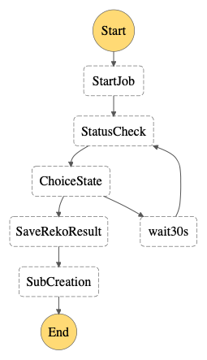

# Smart-Sub-on-PPT-Pages

方案部署完成后，通过以下格式，通过 POST 动作调用封装好的 API：

```json
{
	"videoPath": "要处理的视频的 s3 路径，s3://<BUCKET>/<PREFIX>/VIDEO.mp4"
}
```

需创建以下资源：

序号 | 资源类型 | 资源名称 | 说明 
----|------|------|------
1 | API Gateway | ppt-sub | 服务对外暴露的 API 接口
2 | IAM Role | APIGatewayToStepFunctions | API Gateway 调用 StepFunctions 时使用的角色，通过控制台自动创建即可
3 | IAM Role | ppt-SubRole | Lambda 函数使用的角色。为简化说明，此处为所有 Lambda 创建统一的角色。实际应用中应以最小权限原则创建 Lambda 角色。
4 | Step Functions | ppt-SubCreation | 实现应用的流程
5 | Lambda Function | ppt-01-start-job | 创建 Rekognition、Transcribe 作业
6 | Lambda Function | ppt-02-status-check | 检查作业状态
7 | Lambda Function | ppt-03-save-reko-result | 保存 Rekognition 做业结果
8 | Lambda Function | ppt-04-sub-creation | 根据翻页切换保存转录的文本信息
9 | S3 存储桶 | ppt-sub-bucket | 创建 3 个目录，/Input，/InterJson，/ResultJson
10 | SNS Topic | notifyMe | 整体任务执行完毕后，通过该主题发送消息

Step Functions 状态机被调用后，触发的流程如下图：



## 部署说明

### 环境准备

部署说明中的命令参考 [AWS CLI Version 2 命令规范](https://awscli.amazonaws.com/v2/documentation/api/latest/reference/index.html#cli-aws)，需要根据 [官方文档](https://docs.aws.amazon.com/zh_cn/cli/latest/userguide/install-cliv2.html) 提前安装好 AWS CLI version 2 工具，并配置好拥有 Admin Account 中 **管理员权限** 的 AKSK。如您已经安装 AWS CLI Version 1，可对应本方案原型参考 [AWS CLI Version 1 命令规范](https://docs.aws.amazon.com/cli/latest/reference/)，本方案原型对可能存在的命令差异不再做进一步说明。

将本方案原型代码克隆到本地：

```
git clone  https://github.com/weiping-bj/AWS-AI-Services-in-Media-Industry.git
```

进入方案原型目录：

```
cd AWS-AI-Services-in-Media-Industry/Smart-ASR-on-PPT-Pages
```

设置部署时需要用到的常量，```ACCOUNT_ID``` 和 ```BUCKET_NAME```：

```
ACCOUNT_ID=`aws sts get-caller-identity |jq -r ".Account"`

BUCKET_NAME=amlc-poc-$ACCOUNT_ID
```

>如未安装 [jq](https://stedolan.github.io/jq/download/) 工具，也可以手工设置 ACCOUNT_ID

### 基础资源创建

**1. S3 存储桶**

本资源为选择性创建，可以利用现有存储桶，也可以创建独立的存储桶。无论何种方式，保证存储桶中有以下 3 个目录即可：

- /Input：存放待处理的视频文件；
- /InterJson：用于保存 Rekognition 处理结果；
- /ResultJson：用于保存合成的分段文本结果。

[创建存储桶](https://docs.aws.amazon.com/zh_cn/AmazonS3/latest/userguide/create-bucket-overview.html) 和 [创建目录](https://docs.aws.amazon.com/zh_cn/AmazonS3/latest/userguide/using-folders.html) 的方式可参考官方手册。存储桶可根据管理需要自定义命名。

**2. IAM 角色**

- APIGatewayToStepFunctions

API Gateway 在调用 Step Functions 状态机时使用的角色。可通过控制台创建并自动关联需要的 IAM 策略，遵循 [官方指导](https://docs.aws.amazon.com/zh_cn/step-functions/latest/dg/tutorial-api-gateway.html#api-gateway-step-1) 即可。

- ppt-SubRole

通过控制台或命令行创建一个角色，信任实体为 Lambda 服务，关联以下托管策略：

```
- AmazonS3FullAccess
- AmazonTranscribeFullAccess
- AmazonRekognitionFullAccess
- CloudWatchLogsFullAccess
- AmazonSNSFullAccess
```

将该角色的 ARN 设定为环境变量：

```
SUB_ROLE=<Role Arn>
```

**3. SNS Topic**

需要创建一个 SNS Topic，在本方案需要的任务都完成（获得基于 PPT 换页时间而生成的文本信息）后，向管理员发送通知邮件。

参考 [AWS 官方手册](https://docs.aws.amazon.com/zh_cn/sns/latest/dg/sns-create-topic.html) 创建一个 SNS Topic，可根据需要自定义 Topic 名称。创建完毕后参考 [AWS 官方手册](https://docs.aws.amazon.com/zh_cn/sns/latest/dg/sns-create-subscribe-endpoint-to-topic.html) 使用管理员邮箱订阅该主题。从控制台中查看该出题的 ARN，并设置为环境变量：

```
TOPIC_ARN=<SNS Topic 的 ARN>
```


### Lambda 函数资源

共需要创建 4 个 Lambda 函数，依次创建如下。


**1. ppt-01-start-job**

通过控制台查看 S3 存储桶中 /InterJson 目录的 S3 URI，并保存为环境变量：

```
INTER_FOLDER=</InterJson 目录的 S3 URI>
```

创建函数：

```
aws lambda create-function --function-name ppt-01-start-job \
--role $SUB_ROLE \
--runtime python3.6 \
--handler lambda_function.lambda_handler \
--timeout 10 \
--zip-file fileb://deployment/ppt-01-start-job.zip \
--environment "Variables={ \
INTER_BUCKET="$INTER_FOLDER"}"
```

该函数将启动 Rekognition 和 Transcribe 作业，并将 Transcribe 作业的语音转录结果保存在 <code>$INTER_FOLDER</code> 中。由于必须在 Rekognition 和 Transcribe 作业均正常完成后才能执行状态机中的下一个环节，因此创建 Rekognition 时不必制定 SNS Topic，依靠状态机中的 Lambda 函数轮询检查状态即可。

可从 [这里](code/ppt-01-start-job.py) 查看该函数代码。

**2. ppt-02-status-check**

```
aws lambda create-function --function-name ppt-02-status-check \
--role $SUB_ROLE \
--runtime python3.6 \
--handler lambda_function.lambda_handler \
--timeout 10 \
--zip-file fileb://deployment/ppt-02-status-check.zip
```

该函数负责查看 Rekognition 和 Transcribe 作业的执行状态，并返回状态结果信息。尽管在创建 Rekognition 作业时可以指定一个 SNS Topic，当作业正常完成时通过这个 Topic 发出确认消息。但 Transcribe 并不支持这个特性。因此，需要手工查询两个作业的状态，并统一两个作业的状态码，以确保在作业完成时执行后续工作状态。

返回的状态结果信息包括两类：当两个作业都正常完成时（两个服务在作业正常结束时各自的状态码分别为 “SUCCEEDED” 和 “COMPLETED”），函数反馈 “FINISHED” 状态；当任意一个作业没有完成时，函数返回 “IN_PROGRESS” 状态。

>从实际情况来说，作业执行的状态并不是仅有 “完成” 和 “处理中” 两种。本方案只是功能的原型验证，并未对作业失败、超时等复杂情况做进一步的细分处理。实际应用过程中应根据具体的情况和运维需求做进一步的细化实践。

**3. ppt-02-status-check**

创建函数：

```
aws lambda create-function --function-name ppt-03-save-reko-result \
--role $SUB_ROLE \
--runtime python3.6 \
--handler lambda_function.lambda_handler \
--timeout 10 \
--zip-file fileb://deployment/ppt-03-save-reko-result.zip \
--environment "Variables={ \
INTER_BUCKET="$INTER_FOLDER"}"
```

在创建 Transcribe 作业时已经指明 S3 存储桶中目录的路径，作业完成时会将语音转录文本的结果以 JSON 格式保存到指定目录。Rekognition 并不提供这一功能，需要在确认作业正常结束后，通过代码以显性方式提取完整的作业结果，并保存到指定 S3 存储桶的目录中。

在通过 get_segment_detection API 获取作业的结果时，如果返回结果超过 1000 条（即：一段视频视频中超过 1000 个镜头）时，Rekognition 会对结果进行分页，并使用 *next-token* 字段作为分页索引。在保存结果时就需要注意利用 *next-token* 字段对作业结果进行拼接，以便获得完整结果。

从本方案中的实际情况出发，极少出现一次演讲视频中出现超过 100 页 PPT 的情况。因此该函数代码中仅对返回结果做简单的数量判断、告警，不做多分页结果的拼接。如希望了解利用 *next-token* 进行拼接的方法，可参考 [这段 Lambda 函数](https://github.com/weiping-bj/Smart-Cutting-using-AWS/blob/main/code/sc-03-result-save.py)  代码。

**4. ppt-04-sub-creation**

通过控制台查看 S3 存储桶中 /ResultJson 目录的 S3 URI，并保存为环境变量：

```
RESULT_FOLDER=</ResultJson 目录的 S3 URI>
```

创建函数：

```
aws lambda create-function --function-name ppt-04-sub-creation \
--role $SUB_ROLE \
--runtime python3.6 \
--handler lambda_function.lambda_handler \
--timeout 10 \
--zip-file fileb://deployment/ppt-04-sub-creation.zip \
--environment "Variables={ \
RESULT_BUCKET="$RESULT_FOLDER", \
TOPIC_ARN="$TOPIC_ARN"}"
```

### 应用资源创建

**1. Step Functions 状态机**

创建状态机需要的 IAM 角色：

```
ACCOUNT_ID=`aws sts get-caller-identity | jq -r ".Account"`

SF_NAME=pptSub

ROLE_NAME=sf-$SF_NAME-role   #可根据需要自定义 role 的名称

aws iam create-role --role-name $ROLE_NAME --assume-role-policy-document file://deployment/sf-trusted.json 

sed -i "" 's/<ACCOUNT_ID>/'$ACCOUNT_ID'/g' deployment/sf-pptSub-lambdaInvoke-policy.json

aws iam create-policy --policy-name $SF_NAME --policy-document file://deployment/sf-pptSub-lambdaInvoke-policy.json

aws iam attach-role-policy --role-name $ROLE_NAME --policy-arn arn:aws:iam::$ACCOUNT_ID\:policy/$SF_NAME 

aws iam attach-role-policy --role-name $ROLE_NAME --policy-arn arn:aws:iam::aws:policy/AWSXrayFullAccess

aws iam attach-role-policy --role-name $ROLE_NAME --policy-arn arn:aws:iam::aws:policy/CloudWatchLogsFullAccess

aws iam attach-role-policy --role-name $ROLE_NAME --policy-arn arn:aws:iam::aws:policy/AmazonAPIGatewayInvokeFullAccess
```

创建 Step Functions 的状态机

```
sed -i "" 's/<ACCOUNT_ID>/'$ACCOUNT_ID'/g' deployment/stepFunctions.json

aws stepfunctions create-state-machine --name $SF_NAME --definition file://deployment/stepFunctions.json --role-arn arn:aws-cn:iam::$ACCOUNT_ID\:role/$ROLE_NAME
```

**2. API Gateway**

可参考 [AWS 官方手册](https://docs.aws.amazon.com/zh_cn/step-functions/latest/dg/tutorial-api-gateway.html) 创建 API Gateway 并与刚刚创建好的 Step Functions 状态机进行集成。

名称可根据需求自定义，方法选 POST 即可。

至此，方案部署完毕。

[【返回 README】](README.md)