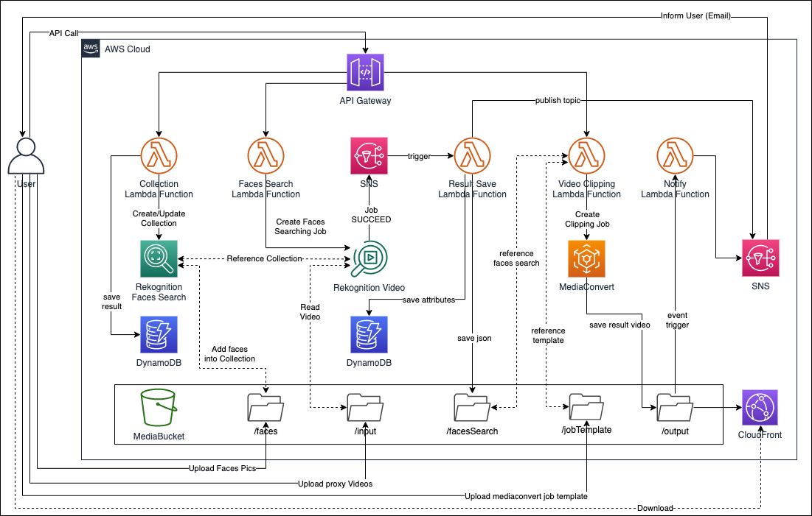

# Smart-Cutting-using-AWS

## 方案概述

- 适用场景：从视频中提取特定人物信息，剪辑成新的视频。例如：从学校的视频中剪辑出自己孩子的镜头，制作明星集锦等。

- 方案概述：本方案原型将介绍一种基于 AI 技术完成视频智能剪辑的方法。主要依赖两个核心功能。一，识别视频中的目标人物；二，针对目标任务进行剪辑。前者依赖于人脸识别技术（例如：Amazon Rekognition），后者则属于媒体行业中的视频合成技术（例如：AWS Elemental MediaConvert）。

- 方案特点：
	- 整个方案使用 AWS 托管服务，无需部署服务器资源；
	- 利用 AI 技术，自动识别目标任务；
	- 无需准备海量训练样本，无需掌握复杂的机器学习技能。

## 架构概述
本方案原型包含两种实现架构。

1. [基础版架构](SmartCutting-basic-CHN.md)；
2. 进阶版架构：
	- [部署说明](SmartCutting-deploy-CHN.md)；
	- [使用说明](SmartCutting-usage-CHN.md)。

### 基础版架构

在基本架构中，主要通过个人终端调用 AWS 相关服务的 API，以人工方式查询任务状态，获取最终结果。

基础版架构图如下：


将使用如下服务：

1. [Amazon Rekognition](https://aws.amazon.com/cn/rekognition/)：图像和视频分析服务；
2. [AWS Elemental MediaConvert](https://aws.amazon.com/cn/mediaconvert/)：具有广播级功能的基于文件的视频转码服务；
3. [AWS Lambda](https://aws.amazon.com/cn/lambda/)：一种无服务器的计算服务，让您无需预置或管理服务器、创建可感知工作负载的集群扩展逻辑、维护事件集成或管理运行时，即可运行代码；
4. [Amazon S3](https://aws.amazon.com/cn/s3/)：对象存储服务，提供行业领先的可扩展性、数据可用性、安全性和性能；
5. [Amazon SNS](https://aws.amazon.com/cn/sns/)：一项用于应用与应用之间 (A2A) 以及应用与人之间 (A2P) 通信的完全托管型消息收发服务。

### 进阶版架构

本方案原型使用如下架构：  


包含如下主要服务：

1. [Amazon Rekognition](https://aws.amazon.com/cn/rekognition/)：图像和视频分析服务；
2. [AWS Elemental MediaConvert](https://aws.amazon.com/cn/mediaconvert/)：具有广播级功能的基于文件的视频转码服务；
3. [Amazon API Gateway](https://aws.amazon.com/cn/api-gateway/)：一种完全托管的服务，可以帮助开发人员轻松创建、发布、维护、监控和保护任意规模的 API；
4. [AWS Lambda](https://aws.amazon.com/cn/lambda/)：一种无服务器的计算服务，让您无需预置或管理服务器、创建可感知工作负载的集群扩展逻辑、维护事件集成或管理运行时，即可运行代码；
5. [Amazon DynamoDB](https://aws.amazon.com/cn/dynamodb/)：是一个键/值和文档数据库，可以在任何规模的环境中提供个位数的毫秒级性能；
6. [Amazon S3](https://aws.amazon.com/cn/s3/)：对象存储服务，提供行业领先的可扩展性、数据可用性、安全性和性能；
7. [Amazon CloudFront](https://aws.amazon.com/cn/cloudfront/)：快速内容分发网络 (CDN) 服务，可以安全地以低延迟和高传输速度向全球客户分发数据、视频、应用程序和 API；
8. [Amazon SNS](https://aws.amazon.com/cn/sns/)：一项用于应用与应用之间 (A2A) 以及应用与人之间 (A2P) 通信的完全托管型消息收发服务。

## 主要技术介绍

从功能角度来说，整个架构可以划分为两个主要部分：人脸识别，视频处理。

### 人脸识别
在视频中检索特定人脸信息可以分成两个关键步骤：建立人脸信息库，利用已有信息库从视频中检索人脸信息。

#### 建立人脸信息库  

用户通过调用 api 创建集合（collection），collection 属于 Rekognition 中的一个概念，包含人脸特征信息。一个人脸集合中可存储的人脸的最大数目为 [2000 万](https://docs.aws.amazon.com/zh_cn/rekognition/latest/dg/limits.html#quotas)。人脸的特征信息如下示例：

```
{
    "FaceModelVersion": "5.0",
    "Faces": [
        {
            "BoundingBox": {
                "Width": 0.5216310024261475,
                "Top": 0.3256250023841858,
                "Left": 0.13394300639629364,
                "Height": 0.3918749988079071
            },
            "FaceId": "0040279c-0178-436e-b70a-e61b074e96b0",
            "ExternalImageId": "image1.jpg",
            "Confidence": 100.0,
            "ImageId": "f976e487-3719-5e2d-be8b-ea2724c26991"
        }
}
```

默认参数下，Rekognition 只提取这些人脸特征：BoundingBox、Confidence、Pose、Quality、和 Landmarks，对于本原型而言已经足够。如果还需要人脸的年龄、表情、眼睛状态、情绪等更细节的属性，可以在调用 index_faces API 时增加 DetectionAttributes=ALL 的参数设置。这可以满足更广泛的应用场景需求，所需要花费的处理时间也会更长。

其中 ExternalImageId 是某一个特定人脸在当前集合中的唯一标识。

为便于查找元数据信息，集合中的 CollectionId、人物的 ExternalImageId 都将保存在 DynamoDB 的表中。

#### 检索视频中的人脸信息

通过调用 API 将视频与已有的集合进行比对，找出视频中的所有人脸信息。
>集合中所包含的人脸信息不一定全部出现在给定的视频中。例如，集合中可能包括全校师生的人脸信息，而给定视频可能只是一个班外出郊游的视频。此种情况下，返回结果中仅包含那些出现过的人脸信息。

这一操作可以进一步分解为两个过程：

- 人脸信息检索：

从视频中检索特定人脸信息是一个异步调用过程，处理时间与 collection 中包含的信息数量以及待处理的视频长度相关。API 调用成功后仅返回生成的 jobId。但 Rekognition 在任务执行结束后可以向 Amazon SNS 服务的指定 Topic 发送消息，以声明任务成功结束。

- 检索信息保存：

利用 jobId 信息可以查看任务返回的详细结果，类似如下示例：

```
{
    "JobStatus": "SUCCEEDED",
    "NextToken": "cbV9RaFdm…",
    "VideoMetadata": {
        "Codec": "h264",
        "DurationMillis": 1800000,
        "Format": "QuickTime / MOV",
        "FrameRate": 25.0,
        "FrameHeight": 480,
        "FrameWidth": 856
    },
    "Persons": [
        {
            "Timestamp": 4480,
            "Person": {…},
	"FaceMatches": [
                {
                    "Similarity": 99.99900817871094,
                    "Face": {…},
                        "ImageId": "15681d6b-",
                        "ExternalImageId": "xxxxxx",
                        "Confidence": 99.99849700927734
                    }
                }
            ]
        },
```

返回结果中包含如下主要信息：

-	视频的元数据信息（视频时长、帧率等）；
-	人脸出现的时间戳（以毫秒为单位）；
-	人脸匹配信息（ExternalImageId，Confidence等）

在单次调用 get_face_search API 时，最多只返回 1000 条信息。对于超过 1000 条信息的检索，get_face_search API 在返回结果中会包含 NextToken字段，这是一个指向后 1000 条检索信息的 hash 指针。通过在循环调用 get_face_search API 中逐条包含 NextToken 字段可顺序获得全部检索结果。

本方案原型中所涉及到的场景将会利用检索结果中的如下信息：

-	视频文件的帧率；
-	人脸出现的时间戳；
-	人脸的 ExternalImageId。

如果每次进行视频处理时都需要调用 get_face_search API 来获取相关的时间码信息，不但增加了 API 调用的负载压力，也不利于后续的程序处理。因此本方案中在调用 get_face_search API 后，将人脸信息结果保存成独立的 json 文件，存放在 S3 存储桶中。视频识别结果的元数据信息也会保存在一个独立的 DynamoDB 表中。

### 视频处理

获取视频中人脸信息出现的时间码信息后，接下来就可以通过选择目标人脸进行视频合成。

本方案原型中使用 AWS Elemental MediaConvert 进行视频合成。

在 Rekognition Video 返回的结果中包含了 ExternalImageId，基于这个标记可以筛选出要检索出来的人员在哪些时间点出现。有两个细节工作需要注意：

1. Rekognition Video 返回的结果以毫秒为单位，而 MediaConvert 在视频处理时以帧（HH:MM:SS:FF）为单位。这就需要根据视频原始帧率，在“毫秒”与“帧”之间进行转换。
2. Rekognition Video 返回的是所有时间点，而不是某个人在视频中出现的时间段。从“时间点”到“时间段”的转换需要使用者通过代码自行时间。例如：当返回结果中两个相邻的 Timestamp 之间间隔大于 1 秒时，我们就可以认为这是两段不同的时间段，如果小于 1 秒则是一段连续时间段中的不同时间点。

完成好时间段和视频帧的转换后，可以通过调用 MediaConvert 的 create_job API 创建视频合成任务。

通过 API 创建 MediaConvert 任务时，需要指定大量参数。所有参数均和可以在调用 create_job API 时进行设置，或通过指定 JSON 文件的方式传入。对于 job 所需要的 JSON 文件，使用者不必从零开始编写，只需要在控制台界面中根据自己的需要设置好各项参数，然后选择控制台界面中的“显示作业JSON”选项，将自动生成的内容复制出来生成新的 JSON 文件即可。

为实现本文所涉及的场景，只需要设置基本的输入（待处理视频位置）、输出（处理后视频位置、视频片段起止时间、输出视频名称）参数即可。需要注意的是，在输出选项中“速率控制模式”参数是必填项，支持有可变比特率(VBR)、恒定比特率(CBR)还是质量定义的可变比特率(QVBR)三种模式。推荐使用 QVBR 方式，不同分辨率下 QVBR 的推荐参数值可以参考 [官方文档](https://docs.aws.amazon.com/zh_cn/mediaconvert/latest/ug/cbr-vbr-qvbr.html#qvbr-guidelines) 中的介绍。

本原型中已提供一个 [任务模板](resources/job-template.json)，以及一个示例视频。可以利用这些内容对本原型进行验证。

方案的部署过程请参阅《[部署说明](SmartCutting-deploy-CHN.md)》；  
方案的 API 说明请参阅《[使用说明](SmartCutting-usage-CHN.md)》。

[返回 README](../README.md)