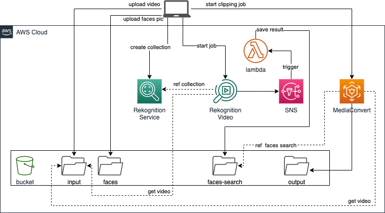
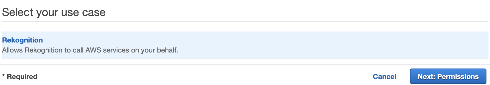
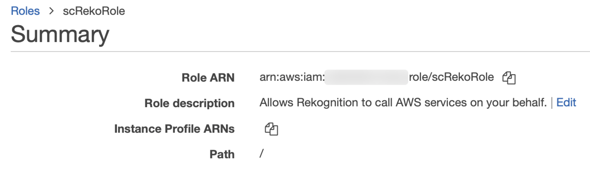

# Deploy-basic-Smart-Cutting

基础版方案原型采用如下架构：  


如希望了解架构设计的整体思路，请参考 [架构说明](README.md) 章节。

## 资源总体说明
### 资源汇总
本方案原型共需部署以下资源：

序号 | 资源类型 | 资源名称 
----|------|------
1 | SNS Topic | SmartCutting
2 | S3 Bucket | \<YOUR\_BUCKET\_NAME>
3 | IAM Role | scRole 
4 | IAM Role | scRekoRole
5 | Lambda Function | sc-result-save

### 环境准备
部署说明中的命令参考 [AWS CLI Version 2 命令规范](https://awscli.amazonaws.com/v2/documentation/api/latest/reference/index.html#cli-aws)，需要根据 [官方文档](https://docs.aws.amazon.com/zh_cn/cli/latest/userguide/install-cliv2.html) 提前安装好 AWS CLI version 2 工具，并配置好拥有 Admin Account 中 **管理员权限** 的 AKSK。如您已经安装 AWS CLI Version 1，可对应本方案原型参考 [AWS CLI Version 1 命令规范](https://docs.aws.amazon.com/cli/latest/reference/)，本方案原型对可能存在的命令差异不再做进一步说明。

将本方案原型代码克隆到本地：

```
git clone  https://github.com/weiping-bj/Smart-Cutting-using-AWS.git
```

进入方案原型目录：

```
cd Smart-Cutting-using-AWS
```

设置部署时需要用到的常量，```ACCOUNT_ID``` 和 ```BUCKET_NAME```：

```
ACCOUNT_ID=`aws sts get-caller-identity |jq -r ".Account"`

BUCKET_NAME=sc-poc-$ACCOUNT_ID
```

>如未安装 [jq](https://stedolan.github.io/jq/download/) 工具，也可以手工设置 ACCOUNT_ID

## 资源部署
### SNS Topic
创建一个 SNS 主题：SmartCutting。由 Rekognition 服务使用，Rekognition 将作业完成的状态发送给这个主题创建，并触发 sc-result-save 函数；


创建 SNS 主题：

```
REKO_TOPIC_ARN=`aws sns create-topic --name SmartCutting --region us-east-1 | jq -r ".TopicArn"`
```

### S3 Bucket

创建 S3 Bucket：

```
aws s3api create-bucket --bucket $BUCKET_NAME \
--region us-east-1
```

创建成功后，返回 S3 Bucket 的 ARN。在 S3 Bucket  中创建 3 个目录。目录名称及作用说明如下：

- **faces/**：用于保存需要识别的人物头像照片。

```
aws s3api put-object --bucket $BUCKET_NAME \
--key faces/
```

- **input/**：用于保存需要处理的视频文件。

```
aws s3api put-object --bucket $BUCKET_NAME \
--key input/
```

- **faces-search/**：用于保存人脸识别的结果信息。

```
aws s3api put-object --bucket $BUCKET_NAME \
--key faces-search/
```

- **output/**：用于保存截取后的视频文件。

```
aws s3api put-object --bucket $BUCKET_NAME \
--key output/
```

### IAM Role
本方案原型需要创建两个 IAM Role，一个供 Lambda 函数使用，另一个供 Rekognition 服务使用。

#### scRole
通过控制台，```IAM > 角色 > 创建角色```，选择为 Lambda 创建角色：  


在 ```Attach 权限策略``` 步骤中，选择以下 7 个托管策略：  

- AmazonS3FullAccess
- AmazonRekognitionFullAccess
- CloudWatchLogsFullAccess

将角色命名为 ```scRole```。

#### scRekoRole
本方案原型需要利用 Rekognition 发送 SNS 消息，以便利用 Rekognition 作业结束的状态来触发下一步操作。

通过控制台，```IAM > 角色 > 创建角色```，选择为 Rekognition 创建角色：  


系统会为 Rekogniton 关联一个托管策略：```AmazonRekognitionServiceRole```，通过控制台不能再添加其它策略。选择创建角色，为角色命名为 ```scRekoRole```。

通过控制台，```IAM > 角色``` 查找到刚创建的 ```scRekoRole```，通过【附加策略】按钮，为角色关联一个托管策略：```AmazonSNSFullAccess```。

### Lambda Function

本方案将创建 1 个 lambda 函数：**sc-result-save**，该函数将识别的结果保存成中间文件；

```
aws lambda create-function --function-name sc-result-save \
--role "arn:aws:iam::"$ACCOUNT_ID":role/scRole" \
--runtime python3.6 \
--handler lambda_function.lambda_handler \
--timeout 60 \
--zip-file fileb://resources/sc-result-save.zip \
--environment "Variables={ \
BUCKET_PATH="s3://"$BUCKET_NAME"/faces-search/", \
--region us-east-1
```

可以从 [这里](code/sc-03-result-save.py) 查看函数源代码。

为 SNS Topic: SmartCutting 创建订阅：

```
aws sns subscribe --protocol lambda \
--topic-arn $REKO_TOPIC_ARN \
--notification-endpoint "arn:aws:lambda:us-east-1:"$ACCOUNT_ID":function:sc-03-result-save" \
--region us-east-1
```

为函数 sc-result-save 添加权限，允许 SNS Topic 触发函数：

```
aws lambda add-permission --function-name  sc-03-result-save \
--statement-id AllowInvokeFromSNS_SmartCutting \
--action lambda:InvokeFunction \
--principal sns.amazonaws.com \
--source-arn $REKO_TOPIC_ARN \
--region us-east-1
```

## 方案使用说明
### 上传素材
将需要分析的视频上传至创建好的 s3 存储桶内：

```
s3 cp <LOCAL_VIDEO_PATH>.mp4 s3://$BUCKET_NAME/input/
```

将需要识别的人物照片上传至创建好的 s3 存储桶内：

```
s3 cp <LOCAL_PHOTO_PATH>.jpg s3://$BUCKET_NAME/faces/
```

### 创建头像集合
在 Rekognition 中创建 collection：

```
COLLECTION_ID = <COLLECTION_ID_AS_YOU_NEED>
aws rekognition create-collection --collection-id $COLLECTION_ID
```

向 collection 中添加人脸信息（创建人脸索引）

```
aws rekognition index-faces \
--collection-id $COLLECTION_ID \
--image "S3Object={Bucket=$BUCKET_NAME,Name=faces/<LOCAL_PHOTO_PATH>.jpg}" \
--external-image-id <LOCAL_PHOTO_PATH>
```

上述命令用来提取图片的基本特征值的，包括在图片中人脸所处的位置、人脸的一些特征值、姿势等等。并以照片的文件名作为人物在 collection 中的标识符（extrnalID）。可重复上述命令向 collection 中添加多个人脸信息。

检查 collection 中的结果：

```
aws rekognition list-faces --collection-id $COLLECTION_ID
```

### 在视频中进行人脸识别
创建人脸识别任务：

```
jobID=`aws rekognition start-face-search \
--video "S3Object={Bucket=$BUCKET_NAME
,Name=input/<LOCAL_VIDEO_PATH>.mp4}" \
--collection-id aws-trainers \
--notification-channel "SNSTopicArn=$REKO_TOPIC_ARN,RoleArn=<scRekoRole_ARN>" \
|jq -r ".JobId"
```

其中，```scRekoRole``` 的 ARN 可以登录控制台，通过 ```IAM > 角色 > scRekoRole``` 进行查看：


Rekognition 的任务启动后，需要一段时间来完成处理。可以通过以下命令查看任务状态：

```
aws rekognition get-face-search --job-id $JOB
```

如果反馈的JSON中有 ```IN_PROGRESS```，表示还未处理完。如果处理完毕，会反馈一个非常长的 JSON，显示出所有的面部特征。反馈的结果结果中人脸出现的时间码信息以 ms 为单位。

在调用 ```start-face-search``` API 时添加了 ```--notification-channel``` 用以指明一个 SNS Topic。当 Rekognition 的任务执行结束时会向指定的 SNS 主题发送任务执行完成的消息。本方案原型中，这个发送到 SNS 的消息会触发 Lambda 函数：```sc-result-save```。这个函数会将人脸识别的结果生成一个 json 文件，保存在 ```s3://$BUCKET_NAME/faces-search/``` 中，文件名与视频文件名相同。

### 生成仅包括目标人物的新视频

执行以下命令：

```
python3 code/sc-video-clip.py s3:/$BUCKET_NAME/input/<YOUR_VIDEO>.mp4 s3://$BUCKET_NAME/faces-search/<YOUR_VIDEO>.json <NAME>
```

此段 python 脚本需要传递三个参数：
1. 待处理的视频所在的 s3 存储桶路径；
2. 针对该视频进行检索后，保存了人脸信息时间码的 json 文件在 s3 存储桶上的路径；
3. 希望剪辑出的目标人物（这里目标人物的名称和保存在 s3://$BUCKET_NAME/faces/ 中人物照片所使用的文件名一致）

上述命令执行完成后再等待一段时间，访问 ```s3://$BUCKET_NAME/output/``` 目录，会看到剪辑好的视频文件。

## 小结
本原型演示了如何利用 Amazon Rekognition 和 AWS Elemental MediaConvert 服务实现针对特定人物进行快速剪辑。

在这个原型中，不支持批量创建人脸信息索引，对所有的 jobID 不进行保存，当任务结束时也没有自动化手段通知用户生成视频的下载路径。

上述不足在本方案的进阶版原型中均予以覆盖。请参阅 [进阶版架构部署说明](SmartCutting-deploy-CHN.md) 和 [进阶版架构使用说明](SmartCutting-usage-CHN.md)。

[【返回 README】](README.md)
