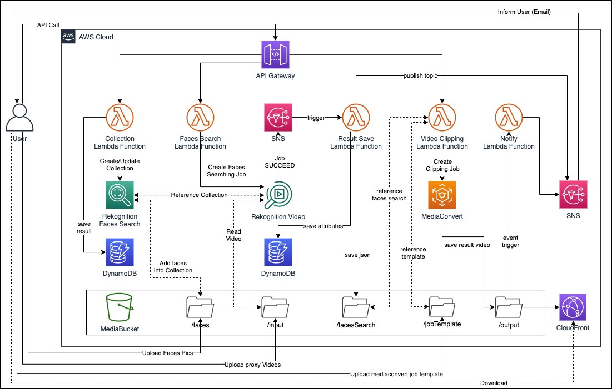
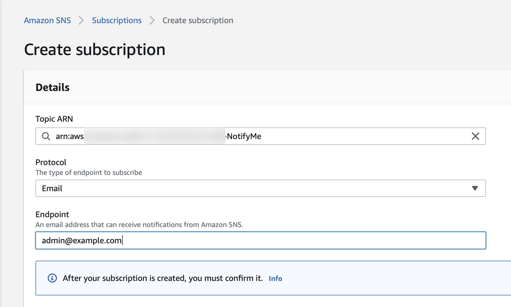
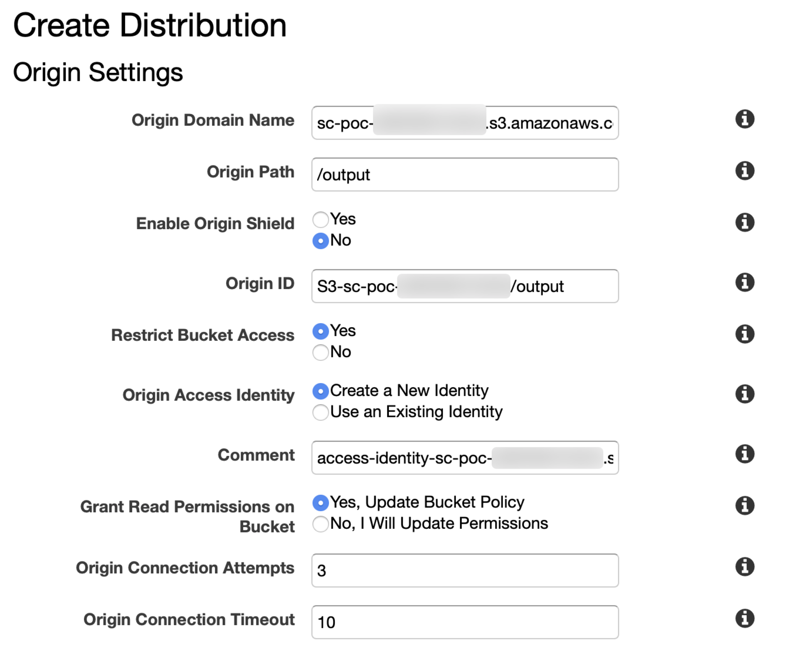
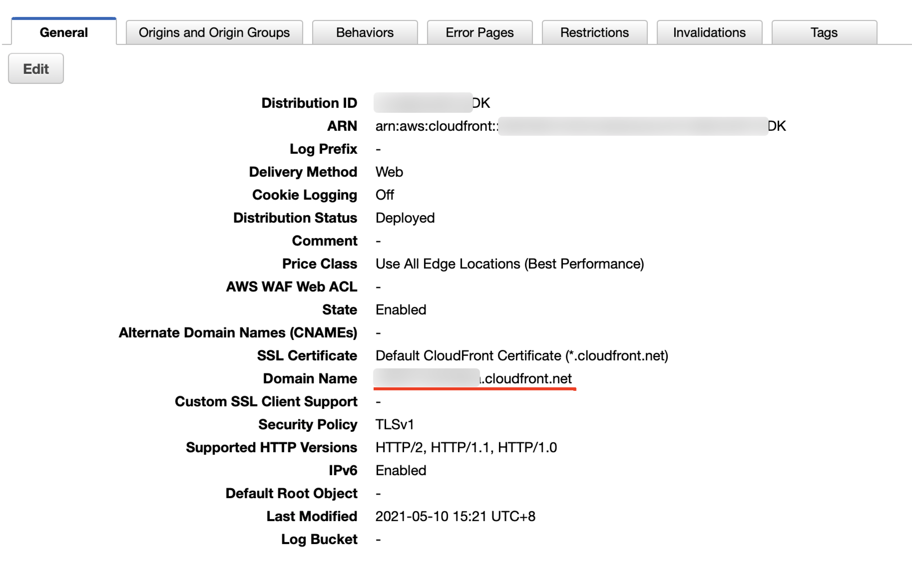
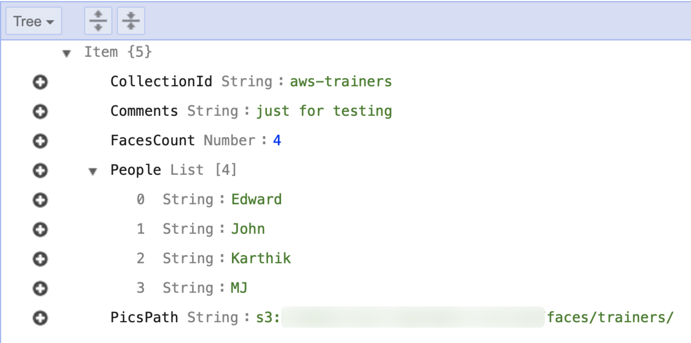
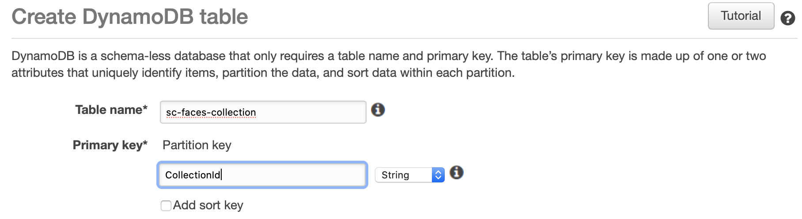
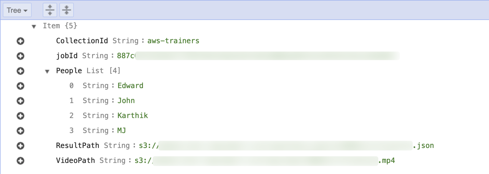
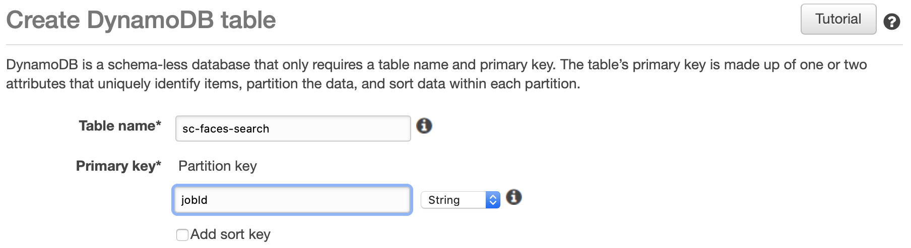

# Deploy-advanced-Smart-Cutting

进阶版方案原型采用如下架构：  


如希望了解架构设计的整体思路，请参考 [架构说明](README.md) 章节；   
如希望了解本方案原型的使用说明，请参考 [使用说明](SmartCutting-usage-CHN.md) 章节。

## 资源总体说明
本方案原型共需部署以下资源：

序号 | 资源类型 | 资源名称 
----|------|------
1 | SNS Topic | SmartCutting
2 | SNS Topic | NotifyMe
3 | S3 Bucket | \<YOUR\_BUCKET\_NAME>
4 | CloudFront Distribution | 
5 | DynamoDB Table | sc-faces-collection 
6 | DynamoDB Table | sc-faces-search 
7 | IAM Role | scRole 
8 | IAM Role | scRekoRole
9 | Lambda Function | sc-01-collection-create
10 | Lambda Function | sc-02-faces-search
11 | Lambda Function | sc-03-result-save
12 | Lambda Function | sc-04-video-clip
13 | Lambda Function | sc-05-notify
14 | API Gateway | smart-cutting


## 环境准备
部署说明中的命令参考 [AWS CLI Version 2 命令规范](https://awscli.amazonaws.com/v2/documentation/api/latest/reference/index.html#cli-aws)，需要根据 [官方文档](https://docs.aws.amazon.com/zh_cn/cli/latest/userguide/install-cliv2.html) 提前安装好 AWS CLI version 2 工具，并配置好拥有 Admin Account 中 **管理员权限** 的 AKSK。如您已经安装 AWS CLI Version 1，可对应本方案原型参考 [AWS CLI Version 1 命令规范](https://docs.aws.amazon.com/cli/latest/reference/)，本方案原型对可能存在的命令差异不再做进一步说明。

将本方案原型代码克隆到本地：

```
git clone  https://github.com/weiping-bj/AWS-AI-Services-in-Media-Industry.git
```

进入方案原型目录：

```
cd AWS-AI-Services-in-Media-Industry/Smart-Cutting-using-AWS
```

设置部署时需要用到的常量，```ACCOUNT_ID``` 和 ```BUCKET_NAME```：

```
ACCOUNT_ID=`aws sts get-caller-identity |jq -r ".Account"`

BUCKET_NAME=sc-poc-$ACCOUNT_ID
```

>如未安装 [jq](https://stedolan.github.io/jq/download/) 工具，也可以手工设置 ACCOUNT_ID

## 资源部署
### SNS Topic
建议创建两个 SNS 主题。

- SmartCutting：由 Rekognition 服务使用，Rekognition 将作业完成的状态发送给这个主题创建，并触发 sc-03-result-save 函数；
- NotifyMe：管理员订阅这个主题，并获知合成视频的下载地址。

创建 SNS 主题：

```
NOTIFY_TOPIC_ARN=`aws sns create-topic --name NotifyMe --region us-east-1 | jq -r ".TopicArn"`

REKO_TOPIC_ARN=`aws sns create-topic --name SmartCutting --region us-east-1 | jq -r ".TopicArn"`

```

通过 AWS 控制台选择 ```Amazon SNS > 订阅 > 创建订阅```，输入网络管理员邮件地址，如下图：  


需要通过管理员的邮箱确认上述订阅。

### S3 Bucket

创建 S3 Bucket：

```
aws s3api create-bucket --bucket $BUCKET_NAME \
--region us-east-1
```

创建成功后，返回 S3 Bucket 的 ARN。在 S3 Bucket  中创建 5 个目录。目录名称及作用说明如下：

- **faces/**：用于保存需要识别的人物头像照片。

```
aws s3api put-object --bucket $BUCKET_NAME \
--key faces/
```

- **input/**：用于保存需要处理的视频文件。

```
aws s3api put-object --bucket $BUCKET_NAME \
--key input/
```

- **faces-search/**：用于保存人脸识别的结果信息。

```
aws s3api put-object --bucket $BUCKET_NAME \
--key faces-search/
```

- **job-template/**：用于保存创建 MediaConvert 作业时需要用到的作业模板。

```
aws s3api put-object --bucket $BUCKET_NAME \
--key job-template/
```

将本方案原型中提供的作业模板上传到新创建的目录下：

```
aws s3 cp resources/job-template.json s3://$BUCKET_NAME/job-template/
```

- **output/**：用于保存截取后的视频文件。

```
aws s3api put-object --bucket $BUCKET_NAME \
--key output/
```

### CloudFront Distribution

登录 AWS 控制台进入 CloudFront 界面，进入```CloudFront > 分配 > 创建分配```，在 ```源域名``` 处输入之前创建的 S3 存储桶名称（可以从下拉菜单中获取），```源路径``` 处输入 ```output/```。

为提升数据安全性，设置 S3 中内容仅可以通过 CloudFront 访问，参考如下设置：

- 限制存储桶访问：是
- 源访问身份：创建新身份
- 注视：保持默认值即可
- 授予对存储桶的读取权限：是，更新存储桶策略

其它参数保持默认，如下图：  


从 AWS 控制台中进入到刚刚创建的分配，在 ```常规``` 标签下查看该分配的域名：  


将分配的域名设置为系统变量：

```
DIS_DOMAIN=xxxxxxx.cloudfront.net
```

### DynamoDB Table
#### sc-faces-collection
当使用 Amazon Rekognition 服务进行人脸检测时，需要先建立关于人脸信息的 collection，但 collection 本身保存的元数据信息不利于查询。这里创建一个 DynamoDB Table，用于记录 collection 的部分原数据信息，包括：人脸数量、人脸名称、所使用的人脸照片所保存的位置，示例如下图：  


通过控制台，```DynamoDB > 表 > 创建表```，表的名称为 ```sc-faces-collection```：  


将 Table 名称设置为系统的环境变量：

```
COLLECTION_TABLE=sc-faces-collection
```

#### sc-faces-search
用于记录搜索时的一些状态信息，包括 jobId、使用了哪个 collection、中间过程的 json 文件保存的位置、生成视频的保存位置等，示例如下图：  


通过控制台，```DynamoDB > 表 > 创建表```，表的名称为 ```sc-faces-search```：  


### IAM Role
本方案原型需要创建两个 IAM Role，一个供 Lambda 函数使用，另一个供 Rekognition 服务使用。

#### scRole
创建一个策略文件：

```
cat << EOF > policy.json
{
    "Version": "2012-10-17",
    "Statement": [
        {
            "Sid": "VisualEditor0",
            "Effect": "Allow",
            "Action": "iam:PassRole",
            "Resource": "*"
        }
    ]
}
EOF
```

创建一个托管策略：

```
aws iam create-policy --policy-name sc-iam-passrole \
--policy-document file://policy.json
```

为本方案原型中的 5 个 Lambda 函数创建一个统一的 IAM Role。
>您还可以根据需要进一步缩小权限，为每个 Lambda 函数创建独立的 IAM Role。

通过控制台，```IAM > 角色 > 创建角色```，选择为 Lambda 创建角色：  


在 ```Attach 权限策略``` 步骤中，选择以下 7 个托管策略：  

- AmazonS3FullAccess
- AmazonDynamoDBFullAccess
- AmazonRekognitionFullAccess
- AmazonSNSFullAccess
- AWSElementalMediaConvertFullAccess
- CloudWatchLogsFullAccess
- sc-iam-passrole

将角色命名为 ```scRole```。

#### scRekoRole
本方案原型需要利用 Rekognition 发送 SNS 消息，以便利用 Rekognition 作业结束的状态来触发下一步操作。

通过控制台，```IAM > 角色 > 创建角色```，选择为 Rekognition 创建角色：  


系统会为 Rekogniton 关联一个托管策略：```AmazonRekognitionServiceRole```，通过控制台不能再添加其它策略。选择创建角色，为角色命名为 ```scRekoRole```。

通过控制台，```IAM > 角色``` 查找到刚创建的 ```scRekoRole```，通过【附加策略】按钮，为角色关联一个托管策略：```AmazonSNSFullAccess```。

### Lambda Function
本方案原型共计需要创建 5 个 lambda 函数：

1. **sc-01-collection-create**：创建包含人脸信息的 collection；
2. **sc-02-faces-search**：启动针对视频文件的人脸识别任务；
3. **sc-03-result-save**：将识别的结果保存成中间文件；
4. **sc-04-video-clip**：利用中间文件中包含的时间码信息对视频进行剪辑；
5. **sc-05-notify**：获取剪辑后视频的存储路径信息，以邮件方式通知用户。

#### sc-01-collection-create

```
aws lambda create-function --function-name sc-01-collection-create \
--role "arn:aws:iam::"$ACCOUNT_ID":role/scRole" \
--runtime python3.6 \
--handler lambda_function.lambda_handler \
--timeout 30 \
--zip-file fileb://resources/sc-01-collection-create.zip \
--environment "Variables={ \
COLLECTION_TABLE=sc-faces-collection}" \
--region us-east-1
```

可以从 [这里](code/sc-01-collection-create.py) 查看函数源代码。

#### sc-02-faces-search

```
aws lambda create-function --function-name sc-02-faces-search \
--role "arn:aws:iam::"$ACCOUNT_ID":role/scRole" \
--runtime python3.6 \
--handler lambda_function.lambda_handler \
--timeout 3 \
--zip-file fileb://resources/sc-02-faces-search.zip \
--environment "Variables={ \
COLLECTION_TABLE=sc-faces-collection, \
FACE_SEARCH_TABLE=sc-faces-search,\
ROLE_ARN="arn:aws:iam::"$ACCOUNT_ID":role/scRekoRole", \
SNS_TOPIC_ARN=$REKO_TOPIC_ARN}" \
--region us-east-1
```

可以从 [这里](code/sc-02-faces-search.py) 查看函数源代码。

#### sc-03-result-save

```
aws lambda create-function --function-name sc-03-result-save \
--role "arn:aws:iam::"$ACCOUNT_ID":role/scRole" \
--runtime python3.6 \
--handler lambda_function.lambda_handler \
--timeout 60 \
--zip-file fileb://resources/sc-03-result-save.zip \
--environment "Variables={ \
BUCKET_PATH="s3://"$BUCKET_NAME"/faces-search/", \
FACE_SEARCH_TABLE=sc-faces-search,\
TOPIC_ARN=$NOTIFY_TOPIC_ARN}" \
--region us-east-1
```

可以从 [这里](code/sc-result-save.py) 查看函数源代码。

#### sc-04-video-clip

```
aws lambda create-function --function-name sc-04-video-clip \
--role "arn:aws:iam::"$ACCOUNT_ID":role/scRole" \
--runtime python3.6 \
--handler lambda_function.lambda_handler \
--timeout 60 \
--zip-file fileb://resources/sc-04-video-clip.zip \
--environment "Variables={ \
BUCKET_PATH="s3://"$BUCKET_NAME"/output/", \
FACE_SEARCH_TABLE=sc-faces-search,\
SENSITIVIT=80}" \
--region us-east-1
```

可以从 [这里](code/sc-04-video-clip.py) 查看函数源代码。

#### sc-05-notify

```
aws lambda create-function --function-name sc-05-notify \
--role "arn:aws:iam::"$ACCOUNT_ID":role/scRole" \
--runtime python3.6 \
--handler lambda_function.lambda_handler \
--timeout 3 \
--zip-file fileb://resources/sc-05-notify.zip \
--environment "Variables={ \
CF_URL=$DIS_DOMAIN, \
TOPIC_ARN=$NOTIFY_TOPIC_ARN}" \
--region us-east-1
```

可以从 [这里](code/sc-05-notify.py) 查看函数源代码。

### API Gateway

本方案原型将创建 3 个 API，作用说明如下：

- collection-create：根据提供的人脸照片信息创建 [collection](https://docs.aws.amazon.com/zh_cn/rekognition/latest/dg/collections.html)；
- faces-search：将视频与 collection 进行比对，搜索指定的人脸在视频中出现的时间；
- video-clip：根据所获得的时间码信息进行视频剪辑。

创建 APIs：

```
REST_API_ID=`aws apigateway create-rest-api --name smart-cutting \
--endpoint-configuration types=REGIONAL \
--region us-east-1 | jq -r ".id"`
```

如未安装 [jq](https://stedolan.github.io/jq/download/) 工具，也可以手工设置 ```REST_API_ID```。执行 ```create-rest-api``` 后，得到如下返回：

```
{
    "id": "xxxxxxx",
    "name": "smart-cutting",
    "createdDate": "2021-04-19T22:42:39+08:00",
    "apiKeySource": "HEADER",
    "endpointConfiguration": {
        "types": [
            "REGIONAL"
        ]
    },
    "tags": {},
    "disableExecuteApiEndpoint": false
}
```
设置返回的 id 为 ```REST_API_ID```。  

查看刚创建的 api-gateway 的资源，并设置 parent-id：

```
PARENT_ID=`aws apigateway get-resources --rest-api-id $REST_API_ID --region us-east-1 | jq -r ".items" | jq -r ".[0].id"`
```

如仅执行 ```get-resources```，得到如下返回：

```
{
    "items": [
        {
            "id": "yyyyyyyyyy",
            "path": "/"
        }
    ]
}
```

可手工记录下返回的 id 并设置为 ```PARENT_ID```。

#### collection-create
创建资源 ```collection-create```：

```
RESOURCE_ID_COLLECTION=`aws apigateway create-resource --rest-api-id $REST_API_ID \
--parent-id $PARENT_ID \
--path-part collection-create \
--region us-east-1 |jq -r ".id"`
```

如仅执行 ```create-resource```，记录下返回的资源 id，并手工设置 ```RESOURCE_ID_COLLECTION```：

```
{
    "id": "zzzzzz",
    "parentId": "yyyyyyyyyy",
    "pathPart": "collection-create",
    "path": "/collection-create"
}
```

为资源创建方法：

```
aws apigateway put-method --rest-api-id $REST_API_ID \
--resource-id $RESOURCE_ID_COLLECTION \
--http-method POST \
--authorization-type NONE \
--region us-east-1
```

为创建的方法设定集成：

```
aws apigateway put-integration --rest-api-id $REST_API_ID \
--resource-id $RESOURCE_ID_COLLECTION \
--http-method POST \
--type AWS --integration-http-method POST \
--uri 'arn:aws:apigateway:us-east-1:lambda:path/2015-03-31/functions/arn:aws:lambda:us-east-1:'$ACCOUNT_ID':function:sc-01-collection-create/invocations' \
--region us-east-1
```

为方法设定响应：

```
aws apigateway put-method-response --rest-api-id $REST_API_ID \
--resource-id $RESOURCE_ID_COLLECTION \
--http-method POST \
--status-code 200 \
--response-models '{"application/json": "Empty"}' \
--region us-east-1
```

为集成设定响应：

```
aws apigateway put-integration-response --rest-api-id $REST_API_ID \
--resource-id $RESOURCE_ID_COLLECTION \
--http-method POST \
--status-code 200 \
--selection-pattern "" \
--response-templates '{"application/json": "{\"json\": null}"}' \
--region us-east-1
```

为 Lambda 函数 ```sc-01-collection-create``` 添加允许 API Gateway 调用的权限：

```
aws lambda add-permission --function-name sc-01-collection-create \
--statement-id AllowInvokeFromSC_collection_create \
--action lambda:InvokeFunction \
--principal apigateway.amazonaws.com \
--source-arn "arn:aws:execute-api:us-east-1:"$ACCOUNT_ID":"$REST_API_ID"/*/POST/collection-create" \
--region us-east-1
```

#### faces-search
创建资源 ```faces-search```：

```
RESOURCE_ID_FACES=`aws apigateway create-resource --rest-api-id $REST_API_ID \
--parent-id $PARENT_ID \
--path-part faces-search \
--region us-east-1 |jq -r ".id"`
```

为资源创建方法：

```
aws apigateway put-method --rest-api-id $REST_API_ID \
--resource-id $RESOURCE_ID_FACES \
--http-method POST \
--authorization-type NONE \
--region us-east-1
```

为创建的方法设定集成：

```
aws apigateway put-integration --rest-api-id $REST_API_ID \
--resource-id $RESOURCE_ID_FACES \
--http-method POST \
--type AWS --integration-http-method POST \
--uri 'arn:aws:apigateway:us-east-1:lambda:path/2015-03-31/functions/arn:aws:lambda:us-east-1:'$ACCOUNT_ID':function:sc-02-faces-search/invocations' \
--region us-east-1
```

为方法设定响应：

```
aws apigateway put-method-response --rest-api-id $REST_API_ID \
--resource-id $RESOURCE_ID_FACES \
--http-method POST \
--status-code 200 \
--response-models '{"application/json": "Empty"}' \
--region us-east-1
```

为集成设定响应：

```
aws apigateway put-integration-response --rest-api-id $REST_API_ID \
--resource-id $RESOURCE_ID_FACES \
--http-method POST \
--status-code 200 \
--selection-pattern "" \
--response-templates '{"application/json": "{\"json\": null}"}' \
--region us-east-1
```

为 Lambda 函数 ```sc-02-faces-search``` 添加允许 API Gateway 调用的权限：

```
aws lambda add-permission --function-name sc-02-faces-search \
--statement-id AllowInvokeFromSC_faces_search \
--action lambda:InvokeFunction \
--principal apigateway.amazonaws.com \
--source-arn "arn:aws:execute-api:us-east-1:"$ACCOUNT_ID":"$REST_API_ID"/*/POST/faces-search" \
--region us-east-1
```

#### video-clip
创建资源 ```video-clip```：

```
RESOURCE_ID_VIDEO=`aws apigateway create-resource --rest-api-id $REST_API_ID \
--parent-id $PARENT_ID \
--path-part video-clip \
--region us-east-1 |jq -r ".id"`
```

为资源创建方法：

```
aws apigateway put-method --rest-api-id $REST_API_ID \
--resource-id $RESOURCE_ID_VIDEO \
--http-method POST \
--authorization-type NONE \
--region us-east-1
```

为创建的方法设定集成：

```
aws apigateway put-integration --rest-api-id $REST_API_ID \
--resource-id $RESOURCE_ID_VIDEO \
--http-method POST \
--type AWS --integration-http-method POST \
--uri 'arn:aws:apigateway:us-east-1:lambda:path/2015-03-31/functions/arn:aws:lambda:us-east-1:'$ACCOUNT_ID':function:sc-04-video-clip/invocations' \
--region us-east-1
```

为方法设定响应：

```
aws apigateway put-method-response --rest-api-id $REST_API_ID \
--resource-id $RESOURCE_ID_VIDEO \
--http-method POST \
--status-code 200 \
--response-models '{"application/json": "Empty"}' \
--region us-east-1
```

为集成设定响应：

```
aws apigateway put-integration-response --rest-api-id $REST_API_ID \
--resource-id $RESOURCE_ID_VIDEO \
--http-method POST \
--status-code 200 \
--selection-pattern "" \
--response-templates '{"application/json": "{\"json\": null}"}' \
--region us-east-1
```

为 Lambda 函数 ```sc-04-video-clip``` 添加允许 API Gateway 调用的权限：

```
aws lambda add-permission --function-name sc-04-video-clip \
--statement-id AllowInvokeFromSC_video_clip \
--action lambda:InvokeFunction \
--principal apigateway.amazonaws.com \
--source-arn "arn:aws:execute-api:us-east-1:"$ACCOUNT_ID":"$REST_API_ID"/*/POST/video-clip" \
--region us-east-1
```

部署 API：  

```
aws apigateway create-deployment --rest-api-id $REST_API_ID \
--stage-name poc \
--region us-east-1
```

### 添加 S3 事件驱动
本方案原型需要在两个地方设定使用 S3 实践驱动 lambda 函数：

- sc-03-result-save：通过 SNS Topic: SmartCutting 触发；
- sc-05-notify：通过 S3 存储桶中 /output 目录下的事件出发。

#### sc-03-result-save

为 SNS Topic: SmartCutting 创建订阅：

```
aws sns subscribe --protocol lambda \
--topic-arn $REKO_TOPIC_ARN \
--notification-endpoint "arn:aws:lambda:us-east-1:"$ACCOUNT_ID":function:sc-03-result-save" \
--region us-east-1
```

为函数 sc-03-result-save 添加权限，允许 SNS Topic 触发函数：

```
aws lambda add-permission --function-name  sc-03-result-save \
--statement-id AllowInvokeFromSNS_SmartCutting \
--action lambda:InvokeFunction \
--principal sns.amazonaws.com \
--source-arn $REKO_TOPIC_ARN \
--region us-east-1
```

#### sc-05-notify

创建一个 json 文件，用于描述需要从 S3 存储桶过滤的时间类型：

```
ARN=arn:aws:lambda:us-east-1:"$ACCOUNT_ID":function:sc-05-notify

cat << EOF > notification.json
{
    "LambdaFunctionConfigurations": [
        {
            "Id": "trigger-lambda-function-sc-05-notify",
            "LambdaFunctionArn": "$ARN",
            "Events": [
                "s3:ObjectCreated:*"
            ],
            "Filter": {
                "Key": {
                    "FilterRules": [
                        {
                            "Name": "Prefix",
                            "Value": "output/"
                        },
                        {
                            "Name": "Suffix",
                            "Value": ".mp4"
                        }
                    ]
                }
            }
        }
    ]
}
EOF
```

为函数 sc-05-notify 添加权限，允许 S3 事件触发函数：

```
aws lambda add-permission --function-name  sc-05-notify \
--statement-id AllowInvokeFromS3_sc_poc_bucket \
--action lambda:InvokeFunction \
--principal s3.amazonaws.com \
--source-account $ACCOUNT_ID \
--source-arn arn:aws:s3:::$BUCKET_NAME \
--region us-east-1
```

为 S3 存储桶添加事件订阅：

```
aws s3api put-bucket-notification-configuration \
--bucket $BUCKET_NAME \
--notification-configuration file://notification.json \
--region us-east-1
```

至此，整体环境部署完毕。使用说明请参考 [使用指导](SmartCutting-usage-CHN.md)。


[返回 README](README.md)

