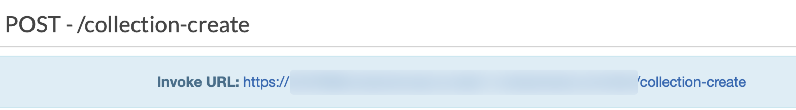
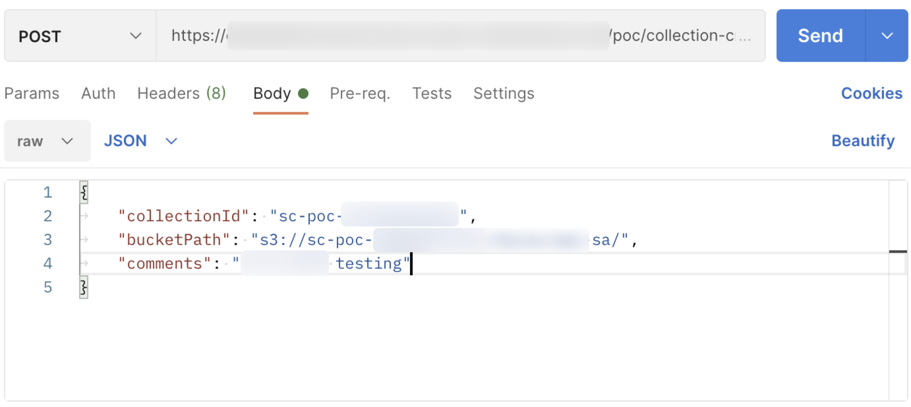

# Usage-about-Smart-Cutting

## 使用说明
方案原型通过 Amazon API Gateway 对外暴露 3 个 REST API：

-	collection-create：创建 collection，并从指定的 S3 目录中读取照片，将照片中的人脸信息逐一添加到 collection，以照片的文件名作为人脸信息的 ExternalImageId。
-	faces-search：根据指定的 collectionid，对保存在 S3 存储桶中的视频文件进行人脸检索。
-	video-clip：创建 MediaConvert Job，按照指定的 ExternalImageId 合成剪辑后的视频。

创建 collection、利用 collection 查找视频中的人物、利用找到的人物时间码进行视频剪辑，这三者本身没有必然的联系。在现实中，可以创建多个 collection，例如：家庭（包含每个家庭成员照片）、学校（包含每个同学照片）、同事（包含每位同事照片）。

在进行视频检索时，不必每次都创建新的 collection，可以重复使用之前创建过的 collection。例如，有个在校期间的拍摄的视频文件，在进行人脸信息识别时就都可以使用同一个 collection（学校）。

进行视频剪辑时，每次需要剪辑出的目标任务可能不同。例如，今天可能只希望剪辑出 2 号同学的视频，明天可能希望剪辑出 13 号同学的视频，后天则是 19 号同学。

因此，本方案原型中创建了 3 个相互独立的 API。在实际部署中，可以根据需要做相应的调整。

如希望通过本方案原型中自带的示例文件进行 API 验证，请先执行以下操作。

1. 上传人脸照片信息：

```
aws s3api put-object --bucket $BUCKET_NAME --key faces/sa/

aws s3 sync resources/sa/ s3://$BUCKET_NAME/faces/sa/
```

2. 上传视频信息：

```
aws s3 cp resources/SA.mp4 s3://$BUCKET_NAME/input/
```

## API 说明
### collection-create
通过 API Gateway 控制台，```API > smart-cutting > 阶段 > poc > /collection-create > POST``` 可以查看到 API 的调用 URL，如下图：  


使用 postman 调用 API：  
>也可以使用其它方式调用 API



各参数说明如下：

- collectionId (string)：为创建的 collection 起一个 ID，collection id 不能重复；
- bucketPath (string)：照片信息所在的 S3 目录路径，此处仅写目录路径，不是对象路径，lambda 会执行批处理操作，将目录下所有照片加入到同一个 collection 中；
- comments (string)：备注信息。

例如：

```
{
	"collectionId": "testing-collection-04021319",
	"bucketPath": "s3://bucket/folder/faces/",
	"comments": "just a sample"
}
```

### faces-search
通过 API Gateway 控制台，```API > smart-cutting > 阶段 > poc > /faces-search > POST``` 可以查看到 API 的调用 URL。

使用 postman 调用 API，各参数说明如下：

- collectionId (string)：需要使用的 collection id；
- videoPath (string)：视频文件在 s3 上的存储路径；
- comments (string)：备注信息。

例如：

```
{
	"collectionId": "testing-collection-04021319",
	"videoPath": "s3://<BUCKET_NAME>/input/<VIDEO>.mp4",
	"comments": "just for testing"
}
```

当任务执行完毕后，会收到一封邮件，邮件中写明生成的包含人脸时间码信息的 json 文件所保存的 s3 路径。示例如下：

```
{
  "JobId": "xxxxxxxxx",
  "VideoPath": "s3://$BUCKET_NAME/input/<VIDEO_NAME>.mp4",
  "ResultPath": "s3://$BUCKET_NAME/faces-search/<VIDEO_NAME>.json",
  "People": [
    "xxxx",
    "yyyy",
    "zzzz",
    ......
  ]
}
```

### video-clip
通过 API Gateway 控制台，```API > smart-cutting > 阶段 > poc > /video-clip > POST``` 可以查看到 API 的调用 URL。

使用 postman 调用 API，各参数说明如下：

- templatePath (string)：创建 MediaConvert 任务时需要指定任务模板，这里需要写明任务模板所在的 s3 路径；
- videoPath (string)：视频文件在 s3 上的存储路径；
- facePath (string)：在 face-search 过程中，识别完视频中的人脸信息后会生成一个 JSON 文件，这里需要填写该文件的 S3 存储路径；
- targetPeople (string)：需要识别的人员代号，这里的代号需要和创建 collection 时使用的照片文件名相同。可以一次查找多个人，中间用英文输入法的逗号 “ , ” 隔开。

例如：

```
{
	"templatePath": "s3://$BUCKET_NAME/job-template/job-template.json",
	"videoPath": "s3://$BUCKET_NAME/input/<VIDEO>.mp4",
	"facePath": "s3://$BUCKET_NAME/faces-search/<FILE>.json",
	"targetPeople": "xxx, yyy, zzz"
}
```

执行结束后，会收到邮件通知，告知剪辑后文件的下载链接。

[返回 README](README.md)