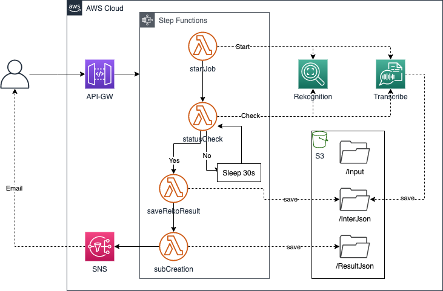
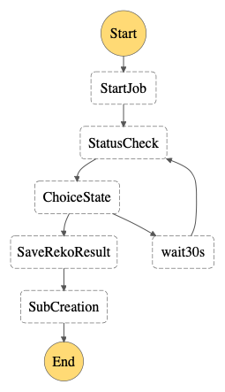
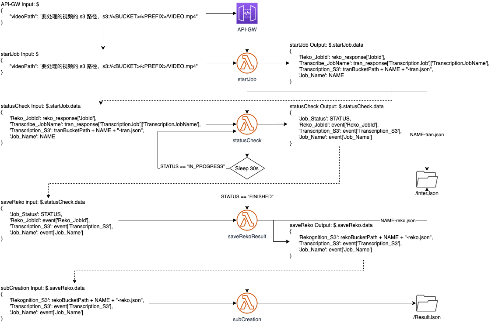

# Smart-Sub-with-AWS
## 特点概述
许多公司、培训机构会通过网络来完成课程、培训，这一现象自 2020 年开始变得更为普遍。这些在线培训会同步进行录像，生成的录像保存在网络中供日后进行视频点播（VOD）使用。

通常，这类视频中所展现的画面是培训时使用到的幻灯片，声音则是讲师的宣讲内容。

本原型介绍了一种方案，可以利用 AWS 托管的 AI 服务、Media 服务，将讲师宣讲内容自动转换为文本信息，并根据幻灯片的切换对文本信息进行分段。通过生成的文本，后续的观看者可以快速了解讲师在每页幻灯片中所讲的内容，并快速定位到时间信息。

本方案具有如下特点：

1. 整个方案使用 AWS 托管服务，无需部署服务器资源；
2. 利用 AI 技术，自动识别目标任务；
3. 无需准备海量训练样本，无需掌握复杂的机器学习技能。

本方案对视频处理完成后，将根据幻灯片的切换合并生成的文字信息示例如下：

```
{
  "Segments": [
    {
      "Type": "Subtitle_Seg",
      "StartTimestampMillis": 540,
      "EndTimestampMillis": 49880,
      "DurationMillis": 49340,
      "Subtitles": "大家下午好......"
    },
    {
      "Type": "Subtitle_Seg",
      "StartTimestampMillis": 49880,
      "EndTimestampMillis": 86840,
      "DurationMillis": 36960,
      "Subtitles": "百分之三十啊......"
    },
    {
      "Type": "Subtitle_Seg",
      "StartTimestampMillis": 88850,
      "EndTimestampMillis": 154660,
      "DurationMillis": 65810,
      "Subtitles": "那么好具体来再来看一下......"
    },
    ......
  ]
}
```

## 架构介绍
本方案原型采用如下架构：  


方案将使用如下服务：

1. [Amazon Rekognition](https://aws.amazon.com/cn/rekognition/)：图像和视频分析服务；
2. [AWS Transcribe](https://aws.amazon.com/cn/transcribe/)：使用一种称为自动语音识别 (ASR) 的深度学习过程，快速准确地将语音转换为文本；
3. [Amazon API Gateway](https://aws.amazon.com/cn/api-gateway/)：一种完全托管的服务，可以帮助开发人员轻松创建、发布、维护、监控和保护任意规模的 API；
4. [AWS Lambda](https://aws.amazon.com/cn/lambda/)：一种无服务器的计算服务，让您无需预置或管理服务器、创建可感知工作负载的集群扩展逻辑、维护事件集成或管理运行时，即可运行代码；
5. [AWS Step Functions](https://aws.amazon.com/cn/step-functions/)：一个无服务器函数编排工具，可轻松将 AWS Lambda 函数和多个 AWS 服务按顺序安排到业务关键型应用程序中；
6. [Amazon S3](https://aws.amazon.com/cn/s3/)：对象存储服务，提供行业领先的可扩展性、数据可用性、安全性和性能；
7. [Amazon SNS](https://aws.amazon.com/cn/sns/)：一项用于应用与应用之间 (A2A) 以及应用与人之间 (A2P) 通信的完全托管型消息收发服务。


## 主要技术介绍

### 镜头检测
镜头是由一台相机连续拍摄的一系列相互关联的连续照片，表示在时间和空间上的连续动作。借助 Amazon Rekognition Video，可以检测每个镜头的开始、结束和持续时间，并且可以计数内容片段中的所有镜头。

当视频内容是播放幻灯片时，每次幻灯片的切换都可等同于一次镜头的切换。

Rekognition 识别镜头分段的结果中包括了镜头（即：幻灯片放映）的起、止时间码和持续时间码信息，时间码以毫秒 和 HH:MM:SS:FF 两种方式表示。类似如下输出：

```
 "Segments": [
        {
            "Type": "SHOT",
            "StartTimestampMillis": 0,
            "EndTimestampMillis": 49960,
            "DurationMillis": 49960,
            "StartTimecodeSMPTE": "00:00:00:00",
            "EndTimecodeSMPTE": "00:00:49:24",
            "DurationSMPTE": "00:00:49:24",
            "ShotSegment": {
                "Index": 0,
                "Confidence": 99.9052734375
            }
        },
        {
            "Type": "SHOT",
            "StartTimestampMillis": 50000,
            "EndTimestampMillis": 88960,
            "DurationMillis": 38960,
            "StartTimecodeSMPTE": "00:00:50:00",
            "EndTimecodeSMPTE": "00:01:28:24",
            "DurationSMPTE": "00:00:38:24",
            "ShotSegment": {
                "Index": 1,
                "Confidence": 95.96501159667969
            }
        },
        ......
]
```

利用这些时间码信息可实现对视频、语音信息的分段处理。

### 自动语音识别
自动语音识别技术被广泛应用于语音转录为文本的场景。Transcribe 不但可以提供语音转文本功能，还会为语音中出现的每个词提供精确的起、止时间码信息，时间码信息以秒为单位。返回结果示例如下：


```
{
	"jobName": "20200811",
	"accountId": "xxxxxxxxxxxx",
	"results": {
		"transcripts": [{
			"transcript": "大家下午好"}],
		"items": [{
			"start_time": "0.54",
			"end_time": "0.84",
			"alternatives": [{
				"confidence": "0.9999",
				"content": "大家"
			}],
			"type": "pronunciation"
		}, {
			"start_time": "0.84",
			"end_time": "1.1",
			"alternatives": [{
				"confidence": "0.7225",
				"content": "下午"
			}],
			"type": "pronunciation"
		}, {
			"start_time": "1.1",
			"end_time": "1.54",
			"alternatives": [{
				"confidence": "0.7698",
				"content": "好"
			}],
			"type": "pronunciation"
		},
		"status": "COMPLETED"
} 
```

### 函数编排技术
为实现镜头识别、语音转文本、文本分段等功能，本方案采用了多个 lambda 函数。由于 Rekognition 和 Transcribe 均为异步调用，这就需要一个协同工具来完成多个 lambda 函数之间的调度工作。

具体到本方案来说，一个完整的任务包括以下几步工作：

1. 启动任务，进行镜头识别、语音识别；
2. 查看任务状态，若完成则进入下一环节，若未完成则等待；
3. 保存任务结果；
4. 根据镜头识别结果进行语音文本的分段合并。

利用 Step Functions 创建的状态机流程如下图：  


状态机中各 lambda 函数之间传递的参数关系如下图：  


## 部署及使用
方案的部署过程请参考 [部署说明](SmartSub-deploy-CHN.md)；  
方案的使用请参考 [使用说明](SmartSub-usage-CHN.md)