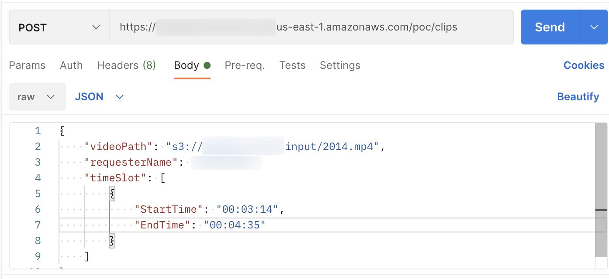

## Usage-about-Quick-Clips

### 使用说明
通过 API Gateway 控制台，```API > quick-clips > 阶段 > poc > /clips > POST``` 可以查看到 API 的调用 URL，如下图：  


使用 postman 调用 API：  
>也可以使用其它方式调用 API



各参数说明如下：

- videoPath (string)：待处理的视频在 S3 中的存放路径
- requesterName (string)：申请者的名字
- timeSlot (map)：希望截取的视频片段的起止时间，时间码采取 HH:MM:SS 格式。

例如：

```
{
    "videoPath": "s3://<BUCKET_NAME>/<FOLDER_NAME>/<VIDEO_NAME>.mp4",
    "requesterName": "weiping-bj",
    "timeSlot": [
        {
            "StartTime": "00:03:14",
            "EndTime": "00:04:35"
        },
         {
            "StartTime": "00:05:24",
            "EndTime": "00:08:05"
        }
    ]
}
```

[返回 README](../README.md)